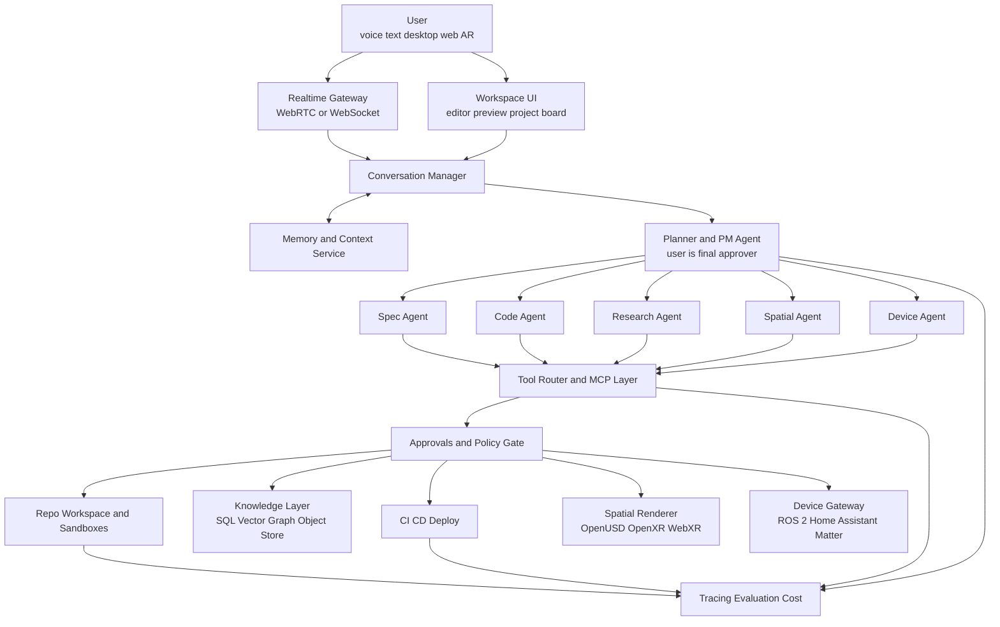
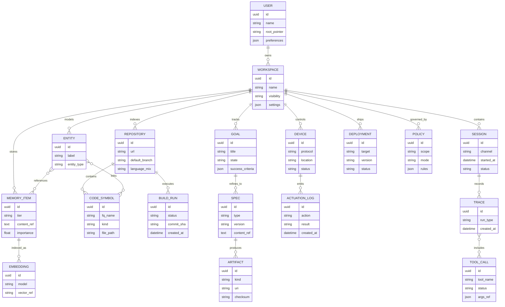
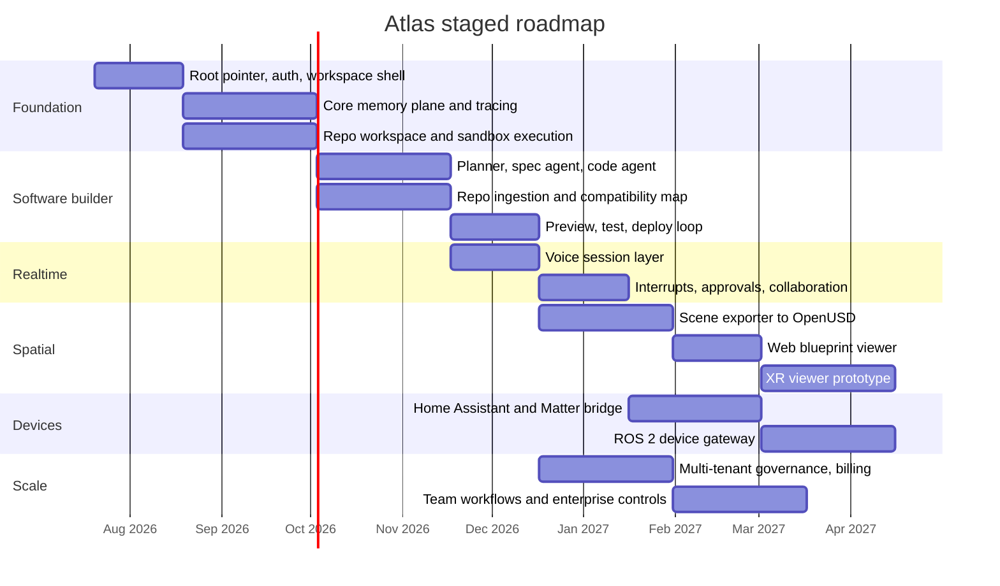

# Atlas Deep Research

## Executive summary

Atlas is most viable if it is built first as a **human-directed, durable agent platform** rather than as a single monolithic AGI product. The shortest credible path is to combine a modern agent control plane, a low-latency voice layer, a code-and-build execution plane, and a structured memory fabric that separates canonical records, retrieval indexes, graph semantics, event streams, and artifact storage. Existing platforms already supply many of the primitives Atlas needs: OpenAI’s Responses API, Agents SDK, built-in tools, MCP support, Realtime API, and tracing; LangGraph’s persistence, interrupts, and streaming; and Temporal’s durable workflow execution. Those tools are strong enough that Atlas should spend its novelty budget on orchestration, memory, spatial UX, and device abstraction instead of reimplementing foundational agent runtime mechanics. citeturn13search1turn13search5turn14search1turn14search9turn27search0turn27search1turn27search14turn1search8turn1search4turn1search3

The single most important architectural decision is this: **treat Atlas’s “one thing it remembers forever” not as all memory, but as a signed bootstrap manifest that points to the real memory system**. That preserves your intuition about a permanent root pointer while avoiding the brittleness of a one-file memory model. The actual memory/data plane should be distributed: PostgreSQL for canonical relational state and JSONB metadata, object storage for artifacts and large blobs, Redis for hot state and event streams, a vector index for semantic recall, and a graph store for entities, provenance, repo structure, and cross-document relationships. Qdrant supports hybrid retrieval and multitenancy; Neo4j supports vector indexes plus full-text and graph retrieval patterns; PostgreSQL supports JSONB and full-text indexing; Redis supports semantic caching and ordered streams; and MinIO provides immutable versioning and object retention when you need durable artifact storage. GraphRAG and generative-agent memory research both support the broader idea that long-lived agent systems do better when memory is structured, retrieved, and summarized rather than naively appended forever. citeturn4search0turn4search1turn4search4turn3search2turn3search5turn2search14turn3search4turn3search7turn15search3turn15search11turn2search4turn15search0turn15search8turn11search18turn11search1

For the user experience, Atlas should support two interaction modes from the start: **a deterministic “builder loop”** and **a conversational “creative loop.”** The builder loop converts a goal into a spec, repo changes, tests, previews, and deployments. The creative loop keeps the feeling of “talking to Cortex”: live speech, interruptions, streaming output, inline previews, and rapid branch-and-tweak iteration. OpenAI’s Realtime stack is explicitly designed for low-latency live audio, tool use, interruptions, and handoffs; LiveKit gives you a production WebRTC transport layer; Gemini Live offers an additional low-latency voice-and-vision option; and modern agent tooling supports guardrails, approvals, and resumable state so Atlas can suggest direction without taking away final control from you. citeturn14search9turn14search11turn14search16turn14search5turn14search15turn0search1turn0search7turn12search1turn12search13turn27search1turn1search0

The spatial and hardware ambitions are realistic if they are **layered on top of the software platform, not fused into the first release**. For 3D/AR “blueprint” views, OpenUSD is the right scene-description backbone because it supports composition, layering, references, payloads, and scalable scene interchange, while OpenXR is the right runtime-facing standard for cross-device XR portability. On the web, three.js and WebXR are the fastest route to interactive previews; for richer runtime/editor workflows, Unity’s OpenXR stack and Apple’s visionOS platform are practical targets. For real-world devices, Matter is the best standards path for consumer IoT, Home Assistant is an excellent home-lab abstraction and orchestration bridge, and ROS 2 is the right abstraction when Atlas graduates from smart-home style devices into robotics or actuators that need topics, services, and cancellable long-running actions. citeturn9search5turn24search0turn24search8turn24search14turn9search0turn9search3turn9search7turn10search4turn10search10turn10search5turn7search1turn7search9turn8search0turn8search7turn8search9turn8search17turn7search0turn25search12turn25search10turn25search15turn25search11

The fastest path to product-market fit is not “build everything.” It is: **ship Atlas first as an autonomous app-and-tool builder with voice, repo ingestion, test/deploy, and memory; then add spatial blueprinting; then add hardware/IoT; then expand into games and domain-specific creation**. That sequencing matches what is already proven in the market by Replit, v0, Bolt, Lovable, Cursor, Copilot, Claude Code, and Devin: people clearly want natural-language software creation and agentic coding, but the market is fragmented between web-app generators, IDE copilots, and coding agents. Atlas’s differentiation is the unified stack: real-time conversation, durable memory, company-scale orchestration, AR/spatial visualization, and device control under one taste model and one user-directed operating philosophy. citeturn16search15turn16search11turn16search10turn16search3turn17search0turn16search4turn19search0turn18search1

## Product thesis and scope

Atlas is best understood as a **creation operating system** with four nested promises.

The first promise is conversational creation: the user says what they want in plain language, Atlas turns that into plans, code, artifacts, previews, and deployable systems. The second is durable agency: work should persist across interruptions, approvals, longer-running jobs, and iterative refinement, which is exactly the class of behavior emphasized by OpenAI’s Agents SDK, LangGraph persistence/interrupts, and Temporal’s durable execution model. The third is multimodal making: software, documents, diagrams, scene graphs, and eventually hardware behaviors should all be first-class build targets. The fourth is personalization: Atlas should adapt to the user’s preferences, prior work, contexts, and goals without stealing final authority from the user. citeturn27search0turn27search1turn27search13turn1search4turn1search0turn1search3

What Atlas is **not**, at least initially, is a custom LLM, a full game engine, or a new XR runtime. It should stand on top of mature capability layers. OpenAI’s platform already exposes built-in tools, Remote MCP, state strategies, approvals, tracing, and voice paths; Anthropic exposes coding agents, Files/PDF/vision/tooling, computer use, and zero-data-retention options on eligible features; Google’s Gemini stack now exposes Interactions, Live API, file search, code execution, Google Search grounding, and managed agent surfaces. Atlas should route across those capability suppliers instead of trying to replicate them at the model/platform level. citeturn13search5turn13search2turn13search7turn14search9turn20search10turn20search2turn20search5turn20search8turn26search0turn21search15turn12search1turn21search16turn21search0turn21search10turn21search5

A useful way to manage scope is to explicitly separate **core platform**, **surface areas**, and **verticals**.

The core platform is the agent runtime, memory system, execution plane, policy layer, observability, and deployment system. Surface areas are web app building, codebase migration, live voice chat, 3D/AR blueprint views, and device control. Verticals are the packaged experiences built on top of that substrate: internal tools, consumer apps, game worlds, renewable-energy engineering copilots, or endlessly replayable AI-driven RPG systems. That separation matters because the core platform can stay stable while new surfaces and verticals are layered on incrementally. The best evidence that these layers can be separated comes from the current landscape: v0, Bolt, Lovable, and Replit focus on natural-language web-app creation; Cursor, Copilot, Claude Code, and Devin focus on coding-agent workflows; OpenXR/OpenUSD/visionOS live in the spatial layer; and Home Assistant, Matter, ROS 2, and Arduino live in the device layer. Atlas’s product thesis is to integrate those planes. citeturn16search11turn16search10turn16search3turn16search15turn17search0turn16search4turn19search0turn18search1turn9search0turn9search5turn10search5turn8search0turn8search9turn7search1turn7search0turn7search3

My recommendation is to choose a first wedge that maximizes three things at once: user value, revenue realism, and platform learning. That wedge is **software application building with repo ingestion and low-latency voice**. It lets Atlas prove the agent loop, memory loop, and execution loop before adding the harder physics of 3D and hardware. Once that core works, the spatial blueprint viewer becomes a force multiplier rather than a distraction, and hardware support becomes a gateway layer rather than an existential dependency.

## Reference architecture

The architecture below reflects the minimum viable “Atlas core” that can grow into the fuller company-scale system you described. It assumes a user-directed agent loop with resumable state, tool approvals, traces, memory compaction, repo workspaces, CI/CD, and optional spatial/device branches. This shape is strongly supported by the current OpenAI, LangGraph, LiveKit, and Temporal primitives, while staying compatible with MCP-style extensions and provider routing. citeturn13search1turn13search5turn14search9turn27search1turn27search14turn1search8turn1search4turn0search1turn1search3

At the control-plane level, Atlas should have one **planner/PM agent** that owns task decomposition and direction proposals, but never bypasses human approval on sensitive side effects. OpenAI’s agent stack explicitly supports tool guardrails and human review that pause a run before shell commands, edits, or sensitive actions; LangGraph interrupts do something similar by saving graph state and waiting for resume input; and Temporal is designed for long-running workflow reliability when processes or hosts fail. That makes “Atlas can assist in direction, but I decide” a first-class architecture rule rather than a prompt wish. citeturn27search1turn27search2turn1search0turn1search4turn1search3turn1search7

The data model should explicitly distinguish users, workspaces, sessions, goals, specs, repos, artifacts, memory items, entities, devices, deployments, tool calls, traces, and policies. That is what lets Atlas behave like a “company in one thing”: it can carry conversation, product intent, code history, scene history, device topology, and evaluation results in one governed graph of records rather than as a chat log pretending to be an operating system.

The right answer to your “single persistent pointer file” idea is: **yes, keep one**, but make it a bootstrap manifest, not a substitute for memory. It should minimally contain the current workspace ID, user identity/profile ref, policy ref, store locations, key fingerprints, and recovery pointers. Then store the substantive data elsewhere. That gives you the “one thing Atlas always remembers” feeling, while also giving you replication, signatures, versioning, and recovery. MinIO’s object versioning and retention features make it a strong artifact backend for this, and artifact signing with Cosign gives you a practical way to ensure the bootstrap record and release artifacts are verifiable. citeturn15search0turn15search8turn6search2turn6search6

A practical storage pattern for Atlas is:

| Need | Recommended pattern | Primary choice | Why it fits Atlas |
|---|---|---|---|
| Canonical records, user/workspace state, specs, deployments | Relational + JSON | PostgreSQL | PostgreSQL combines strong relational semantics with JSONB and full-text search support, making it the right system of record for durable workspace state. citeturn3search4turn3search7 |
| Semantic recall over chats, code chunks, docs, design assets | Hybrid vector retrieval | Qdrant | Qdrant supports hybrid queries, filtering, and multitenancy in ways that fit user/workspace isolation and mixed dense/sparse recall. citeturn4search0turn4search1turn4search4 |
| Entity graph, provenance, repo schema graph, GraphRAG | Knowledge graph + vector/full-text hybrid | Neo4j | Neo4j supports vector indexes, full-text indexes, and first-party GraphRAG tooling, which is valuable for cross-repo reasoning and “how does this connect?” queries. citeturn3search2turn3search5turn2search14 |
| Hot session cache, semantic cache, event streams | In-memory KV + streams | Redis | Redis supports semantic caching, chat history patterns, and append-only streams with consumer groups and replay. citeturn2search4turn2search24turn15search11turn15search15 |
| Artifacts, binaries, logs, scene bundles, previews | Versioned object store | MinIO | MinIO gives you S3-style object storage with versioning and object lock for immutability when needed. citeturn15search0turn15search8 |

For arbitrary codebase ingestion and backward-compatibility work, Atlas should use a multi-stage approach rather than trying to “understand code” from raw file text alone. Tree-sitter gives incremental syntax trees; the Language Server Protocol gives standardized editor/language intelligence interfaces; CodeQL gives semantic analysis for vulnerabilities and structural issues; and OpenAPI provides a normal form for HTTP interfaces that can drive diffing, validation, test generation, and adapter synthesis. CI matrices in GitHub Actions make it possible to test against multiple language or dependency versions during migration and compatibility verification. citeturn5search0turn5search5turn5search14turn5search3turn5search7turn6search0turn6search8

In practice, the ingestion pipeline should be:

```mermaid
flowchart LR
    A[Import repo or package] --> B[Read manifests lockfiles changelogs OpenAPI]
    B --> C[Parse with Tree-sitter]
    C --> D[Augment with LSP symbols refs diagnostics]
    D --> E[Semantic scans with CodeQL]
    E --> F[Build code graph and compatibility map]
    F --> G[Generate migration plan]
    G --> H[Run CI matrix tests]
    H --> I[Open PR with adapters docs and traces]
```

For realtime conversation, Atlas should support two parallel audio architectures. The first is **speech-to-speech live mode** for “talk like a person, interrupt me, show me the build.” OpenAI’s voice-agent guidance explicitly recommends this mode when you want low-latency, natural conversations, barge-in, and realtime tool use. The second is a **chained voice pipeline** for cases where you want deterministic transcripts, explicit intermediate text, and stronger approval control, such as production deployments, compliance workflows, or shell-heavy coding sessions. LiveKit is a strong transport layer because it uses WebRTC to the frontend and gives you production-grade media/session controls. Gemini Live is worth keeping as an alternate provider for low-latency voice-and-vision sessions. citeturn14search9turn14search1turn14search16turn0search1turn0search7turn12search1turn12search13

For 3D/AR blueprints, the key insight is that **Atlas should generate scene descriptions and overlays, not become a new engine first**. OpenUSD gives you layered composition, references, payloads, and efficient partial loading. That makes it ideal for “generated blueprint” scenes where some layers come from the current build, some from user annotations, some from simulation/telemetry, and some from AI proposals. OpenXR then gives you a portable runtime-facing target for headsets and spatial systems, while three.js/WebXR is the fastest browser path and Unity/visionOS are the pragmatic richer-app routes. citeturn24search0turn24search8turn24search14turn9search0turn9search3turn9search7turn10search4turn10search5

For hardware, I recommend a staged gateway model. Arduino-class boards or similar microcontroller devices sit at the edge. Home Assistant is your consumer/home-lab abstraction layer and event bus. Matter is the standards-based interoperability path for smart-home class devices. ROS 2 becomes the device/robot abstraction once you need structured topics, services, or preemptable long-running actions. That lets Atlas span from “toggle a light or read a sensor” to “run a motion sequence and cancel it mid-flight” without forcing a single protocol onto every device. citeturn7search3turn8search0turn8search7turn8search9turn8search17turn7search1turn7search9turn25search12turn25search10turn25search15turn25search11

Security and privacy should be built directly into the runtime. OpenAI’s agent stack supports input/output/tool guardrails and human review; OPA gives you policy-as-code across services and CI/CD; Sigstore/Cosign gives you artifact signing and verification; and Argo CD gives you auditable, GitOps-style deployment control. On data handling, OpenAI’s API docs and enterprise privacy docs make clear that API data is not used for training by default and that abuse logs are retained up to 30 days by default unless your org has different controls; Anthropic documents ZDR for qualified organizations and eligible features; and Google documents abuse monitoring separation from training for Gemini API usage. Atlas should therefore support explicit provider-level privacy modes at the workspace level, not just globally. citeturn27search1turn27search2turn6search3turn6search7turn6search2turn6search6turn6search1turn23search0turn23search1turn23search8turn26search0turn26search8turn26search9turn23search7turn23search10

## Technology choices and platform comparisons

The cleanest recommendation is a **layered vendor strategy**.

Use one primary agent harness, one primary realtime transport, one primary canonical database, and one primary object store. Everything else should be swappable through provider routing, MCP, and clear service boundaries. If you try to make every layer multi-provider on day one, Atlas will move too slowly. If you hardwire every layer to one vendor forever, Atlas will become brittle and expensive.

My recommended phase-one stack is:

| Layer | Recommended primary | Strong alternates | Why |
|---|---|---|---|
| Agent harness | OpenAI Agents SDK | LangGraph; Temporal for long-running jobs | OpenAI gives the fastest integrated path to tools, MCP, guardrails, tracing, sessions, sandboxes, and voice-agent composition; LangGraph is best when you need explicit graph semantics and interrupt-heavy control; Temporal becomes compelling when work routinely spans hours or days across infra boundaries. citeturn13search1turn27search12turn27search14turn27search13turn1search8turn1search0turn1search4turn1search3 |
| Realtime audio transport | LiveKit | OpenAI direct WebRTC; Gemini Live | LiveKit is open-source and production-friendly for WebRTC sessions; OpenAI gives integrated voice-agent semantics; Gemini Live is useful for voice+vision and provider diversity. citeturn0search1turn0search7turn14search9turn12search1 |
| Canonical state | PostgreSQL | none at phase one | Atlas needs relational durability with JSONB and text search more than novelty here. citeturn3search4turn3search7 |
| Semantic memory | Qdrant | Redis vector; pgvector later if desired | Qdrant’s hybrid retrieval and multitenancy are a strong fit for workspace isolation and mixed recall. citeturn4search0turn4search1 |
| Graph memory | Neo4j | GraphRAG-only pipeline without separate DB at small scale | Use only once relational/semantic memory is already working; do not make graph mandatory on day one. citeturn2search14turn3search2turn11search18 |
| Artifacts | MinIO | cloud object storage of your choice | Versioned durable storage is essential for scenes, previews, builds, and replayable outputs. citeturn15search0turn15search8 |
| CI/CD | GitHub Actions + Argo CD | any equivalent GitOps stack | This combination gives versioned matrices, auditable deploys, and rollback-ready Git control. citeturn6search0turn6search8turn6search1 |
| Policy/signing | OPA + Cosign | provider-native controls too | Policy and artifact trust should not live only inside prompts. citeturn6search3turn6search7turn6search2turn6search6 |

The commercial-model routing layer should be explicit. Atlas will benefit from using different models for different jobs instead of demanding one model do everything.

| Role in Atlas | Recommended choice | Why |
|---|---|---|
| Core multi-step agent work, tools, approvals, sandboxes, observability | OpenAI Responses API + Agents SDK | OpenAI’s current stack is unusually integrated across tools, MCP, guardrails, sessions, tracing, sandboxes, and Realtime. citeturn13search5turn13search1turn27search1turn27search13turn27search14 |
| Low-latency voice conversation | GPT-Realtime-2 | OpenAI’s realtime model is specifically positioned for speech-to-speech interactions, instruction following, and reliable tool use in complex voice-agent workflows. citeturn14search5turn14search9 |
| Deep code/doc reasoning and large context | Claude Opus 4.8; Claude Sonnet 5 for cheaper coding workloads | Anthropic explicitly recommends Opus 4.8 for complex tool use and documents broad support for Files, PDF, vision, caching, and 1M-token context on Opus-class models. citeturn20search11turn20search13turn20search2turn20search5turn26search9turn26search4 |
| Alternate realtime voice+vision | Gemini Live | Gemini Live is built for low-latency voice and vision interactions and broad multimodal streaming sessions. citeturn12search1turn12search13 |
| Built-in web, maps, code execution, file search | Gemini Interactions API | Google’s Interactions API now exposes strong built-in tool surfaces that are directly relevant to Atlas. citeturn21search15turn21search3turn21search0turn21search16 |
| Open-weight local multimodal fallback | Gemma 4; Llama 3.2 Vision | Gemma provides open-weight local deployability; Llama 3.2 provides openly available multimodal vision models; use these when privacy, edge execution, or cost control outweigh frontier performance. citeturn22search2turn22search5turn22search8turn12search6 |
| OCR/document ingestion specialist | Mistral OCR 4 | Mistral positions OCR 4 as enterprise document AI with structure and bounding boxes, which is useful for Atlas’s code/doc ingestion path. citeturn12search11 |
| Open-source coding-agent benchmark | Qwen Code | Qwen Code is worth benchmarking because it is explicitly positioned as an open-source agentic coding tool that analyzes codebases and automates development tasks. citeturn22search1turn22search7 |

The relevant platform benchmarks for Atlas fall into two groups: **agent runtimes** and **user-facing builders/coding agents**.

| Runtime or framework | Best use for Atlas | Major strength | Main limitation | Source |
|---|---|---|---|---|
| OpenAI Agents SDK | Phase-one primary harness | Native support for tools, MCP, handoffs, guardrails, tracing, sandboxes, and voice-agent composition | Tighter coupling to OpenAI’s operating model | OpenAI docs citeturn13search1turn27search12turn27search14turn27search13 |
| LangGraph | Interrupt-heavy, graph-structured loops | Durable execution, persistence, human-in-the-loop, resumability | You still own more app integration and infra choices | LangChain docs citeturn1search8turn1search4turn1search0 |
| Temporal | Long-running, high-reliability workflows | Strong durable execution guarantees and infra resilience | Heavier operational footprint for early-stage Atlas | Temporal docs citeturn1search3turn1search7 |
| CrewAI | Multi-agent workflow experimentation | Production-flavored crews/flows abstraction | Less compelling than OpenAI+LangGraph for Atlas’s specific realtime/spatial/hardware ambitions | CrewAI docs citeturn1search2turn1search6 |
| AutoGen | Benchmark/reference, not primary choice | Strong historical multi-agent framing | Official repo says maintenance mode | Microsoft/AutoGen docs citeturn1search5turn1search1 |

| Existing product | What it proves | Gap relative to Atlas | Source |
|---|---|---|---|
| Cursor | Demand for cloud/local coding agents and agent workspaces | Atlas needs broader runtime, memory, AR, and hardware layers | Cursor site/blog citeturn17search0turn17search5turn17search7 |
| GitHub Copilot | Agent mode, cloud agent, repo research, branch changes | GitHub-native and code-centric rather than multimodal creation-OS centric | GitHub docs citeturn16search0turn16search8turn16search4 |
| Claude Code | Strong codebase-aware terminal/IDE agent, skills, memory, review | Still mainly a coding surface, not a creation OS with spatial/device planes | Anthropic docs citeturn19search0turn19search7turn19search10turn19search18 |
| Devin | Proof that teams want autonomous software engineers for multi-repo work | Atlas still needs more direct user conversation, creative iteration, AR, and hardware UX | Devin docs/site citeturn18search1turn18search0turn18search3 |
| Replit | Prompt-to-app creation and deployment demand | Broader creation genres and deeper memory/runtime governance remain open | Replit docs/site citeturn16search9turn16search15 |
| v0 | Prompt-to-full-stack app generation and deploy | Mostly web-app lane; not a general autonomous creation engine | Vercel docs/site citeturn16search11turn16search2turn16search6 |
| Bolt | Chat-to-web/mobile builder demand | Oriented toward browser-based app building, not unified agent OS | Bolt site/docs citeturn16search1turn16search10turn16search5 |
| Lovable | Natural-language full-stack creation with governance | Strong benchmark for UX, weaker on device/spatial ambitions | Lovable docs citeturn16search3 |

The takeaway from that landscape is not “Atlas should beat all of these at once.” It is “Atlas should **compose** the lessons of all of them around one stronger center of gravity”: live conversation, governed autonomy, long-lived memory, cross-surface creation, and eventually spatial/device execution.

## Roadmap, staffing, risks, and monetization

The roadmap below is aggressive but realistic if Atlas is treated as a staged platform build. Dates are illustrative estimates, not commitments.

A good milestone structure is:

| Milestone | What ships | Suggested team | Estimated monthly infra/tool spend | Main risk |
|---|---|---|---|---|
| Atlas Core | workspace shell, auth, memory plane, repo workspace, tracing | founder + 2 engineers | low four figures to start | overbuilding memory/orchestration before user loop is delightful |
| Atlas Builder | goal → spec → repo scaffold → tests → preview → deploy | founder + 3 engineers + part-time designer | low to mid four figures | model/tool cost spikes and low-quality repo edits |
| Atlas Voice | realtime conversation, barge-in, transcripted approvals | add 1 realtime/full-stack engineer | mid four figures | latency and UX inconsistency |
| Atlas Workspace | repo ingestion, migration diffs, compatibility matrix, PR automation | add 1 infra/devtools engineer | mid four to low five figures | arbitrary-codebase complexity |
| Atlas Spatial | OpenUSD export, browser blueprint viewer, first XR prototype | add 1 graphics/XR engineer | mid five figures possible if heavy media | beautiful but non-essential surface steals roadmap |
| Atlas Devices | Home Assistant/Matter gateway, ROS 2 bridge, first actuator demos | add 1 embedded/robotics engineer or contractor | variable | safety, support burden, hardware variability |

That staffing path usually implies a phase-one team of roughly **3–4 people**, then **5–6**, then **6–8** once XR/devices become real surfaces. The exact roles I would prioritize are: full-stack agent engineer, devtools/runtime engineer, memory/data engineer, design engineer, then XR/graphics and embedded/robotics later. Security should be brought in early as a part-time discipline rather than “after launch,” because the first time Atlas can run shell commands, call MCP tools, or actuate devices, security is already part of the product.

The major strategic risks are fairly clear.

| Risk | What it looks like | Mitigation |
|---|---|---|
| Scope explosion | trying to build app generator, IDE, game engine, XR editor, and robotics platform at once | keep one wedge: software creation first |
| Brittle autonomy | agent goes off the rails, users lose trust | approvals by default, reversible actions, write-ahead traces, diff-first UX |
| Memory entropy | Atlas accumulates everything, retrieves the wrong things | tiered memory, compaction, provenance, graph-backed recall, workspace scoping |
| Codebase migration failure | agent edits legacy repos confidently but incorrectly | Tree-sitter + LSP + CodeQL + CI matrix + PR review gates |
| Latency destroying conversation feel | voice interface feels like waiting for a server, not talking to a thinking partner | WebRTC transport, streaming UI, speech-to-speech path, local echo/partial captions |
| XR novelty trap | spatial UI consumes energy before core builder loop is stable | ship 2D browser blueprint view before true headset UX |
| Device safety/support burden | hardware actions create real-world faults or support chaos | restrict early hardware surface to read-mostly, simulation, and gated actuation |

Monetization should also be staged.

For early revenue, the most natural model is a **subscription plus usage system**: a creator tier for solo builders who want conversation-driven app building, a pro tier with repo ingestion and deployment, and a team tier with shared workspaces, approvals, audit logs, and private memory. Later, Atlas can add **enterprise packages** for private deployment, provider controls, data-residency/privacy modes, and custom MCP/tool integrations. A third revenue stream is **vertical packs**: purpose-built Atlas skill packs for software migration, design-to-app conversion, renewable-energy analysis workflows, or AI-assisted game mastering/worldbuilding. The strongest wedge for your personal brand is probably the crossover between **creative software building** and **renewable/solarpunk engineering tools**, because it gives Atlas a story that generic app builders do not have.

## Interview checklist and final review

This checklist is designed for the one-question-at-a-time style you asked for. The questions are ordered so you can stop as soon as the answers are concrete enough to drive a build decision. Ask one, capture the answer, reflect it back in one sentence, then move to the next.

The questions:

1. What is the smallest thing Atlas must successfully build, end to end, for you to say “this is real”?
2. When Atlas suggests a direction you did not ask for, what kinds of suggestions are welcome, and what kinds feel like overreach?
3. What actions require approval every single time: file edits, shell commands, deployments, purchases, device actuation, internet access, or something else?
4. Which surface matters first: web app, desktop app, mobile app, game prototype, internal tool, or hardware control panel?
5. What should Atlas know about you permanently: preferences, goals, recurring projects, tone, tools, design taste, career direction, or all of the above?
6. If Atlas could remember only one bootstrap thing forever, what exact pointer should that be?
7. Which current tools or platforms must Atlas integrate with in the first release?
8. What does “real-time” mean for you in practice: acceptable first-response delay, interruption behavior, and preview-update speed?
9. What kind of visual preview would feel useful first: 2D UI preview, dependency map, system diagram, 3D scene, or AR overlay?
10. What kinds of hardware are actually in scope for year one: none, smart-home devices, microcontrollers, robots, sensors, renewable-energy hardware, or lab equipment?
11. What is the first paid outcome Atlas should produce for you or another user?
12. What would make you stop trusting Atlas immediately?

For collaborators, investors, or future customers, add four follow-up questions after the core twelve:

- If Atlas had to specialize before it generalized, which domain should it own first?
- What evidence would convince you Atlas is safer than a normal autonomous coding agent?
- What part of the current workflow do you most want to delete from your life?
- If Atlas worked perfectly, what would your week look like six months later?

The final review steps before locking a build plan are simple and should be run in order:

- Write the one-sentence product definition of Atlas in plain English.
- Write the first wedge in one sentence and the first non-goal in one sentence.
- Freeze the approval policy for phase one.
- Freeze the memory schema for the bootstrap manifest and canonical workspace tables.
- Freeze the first supported artifact types.
- Freeze the first supported deployment target.
- Decide whether phase one is OpenAI-native, LangGraph-first, or mixed.
- Decide whether XR and hardware are phase-two or phase-three.
- Define the first success metric that is not vanity: successful shipped projects, retained weekly users, or paid conversions.
- Define the kill criteria for any feature branch that becomes a fascination instead of a business.

If I were collapsing the whole report into one build sentence, it would be this: **Atlas should begin as a voice-capable, human-directed autonomous software builder with durable memory, repo ingestion, approvals, and deployable outputs; then grow into a spatial creation interface and device-control platform once the core builder loop is trusted, fast, and repeatable.**