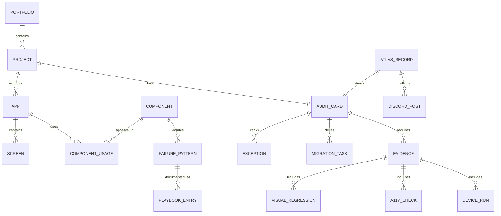
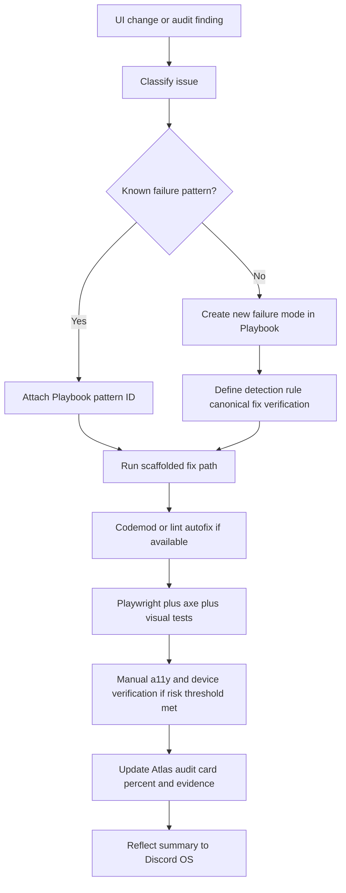
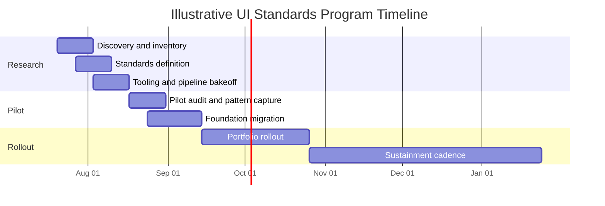
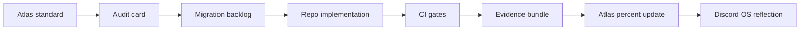
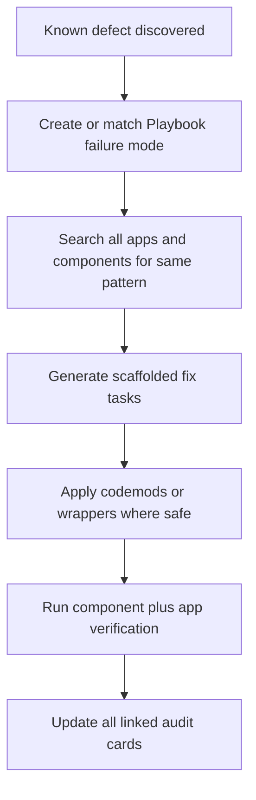
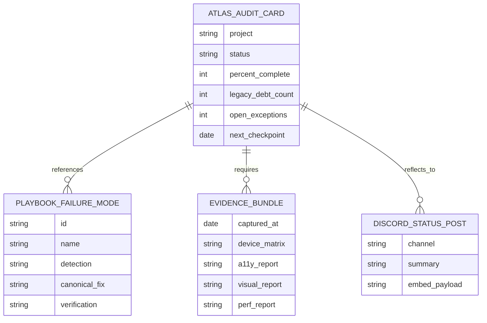

# Comprehensive UI Standards Program, Audit System, and Migration Plan

**Done:** captured the operating decisions from this thread and folded them into a single program design: Atlas as the primary system of record, Discord OS as the visual reflection, persistent audit cards on project boards, mobile and multi-device verification during development, and Playbook-based pattern tracking for scaffolded fixes.

**Now:** define a rigorous standards program, audit model, migration strategy, CI/CD enforcement path, and research phases that can backfill existing apps, constrain in-flight work, and govern all future UI work.

**Next:** drop an Atlas-ready operating model, comparison tables, templates, checklists, and mermaid diagrams that can be pasted into the main Atlas thread and used as the seed for implementation.

**Health check:** no repository context is loaded in this chat. The plan below is portfolio-level and assumes multiple active repositories, multiple existing apps, and mixed maturity across codebases.

## Executive summary

The strongest path is to treat this as a **standing UI governance program**, not a one-time cleanup. The program should establish a single standards baseline centered on **WCAG 2.2 AA**, responsive and mobile-first behavior, canonical component and token rules, and required evidence for multiple device classes. W3C recommends using the latest WCAG version, WCAG 2.2 is organized under the four POUR principles, and WCAG 2.2 adds criteria directly relevant to your concerns, including **Reflow**, **Focus Not Obscured**, **Dragging Movements**, and **Target Size**. WCAG 2.2 is also backward-compatible with prior WCAG 2 versions, which makes it a strong modernization anchor for both new and existing apps. citeturn9view0turn9view1turn21view0turn21view2turn22view2

The program should run on three lanes at the same time. First, **stop the bleeding** for in-progress and future work by adding standards gates to design review, PR review, CI, and release criteria. Second, **inventory and score** every current app and shared component so the portfolio has an objective baseline. Third, **retrofit existing apps** through shared component and token migration, pattern-level remediation, and targeted screen rewrites rather than attempting app-by-app aesthetic rewrites in isolation. Section 508 guidance is explicit that accessibility needs should be incorporated from planning through maintenance, and that deferring conformance to the end of the lifecycle increases rework cost; the same logic applies to your broader UI standards program, not just accessibility. citeturn19search0turn19search1turn19search2

Your persistent audit-card idea is correct and should be formalized. Each project should have exactly one **UI Standards Audit** card that remains visible on the board for the life of the project. It should never be “closed” as a normal feature card. Instead, it moves through states such as **Baseline**, **Migration Active**, **Compliant**, and **Sustain**, while retaining a **percent-complete field** and a **legacy-debt count**. If a board implementation uses GitHub Projects, this maps cleanly to custom number, single-select, date, and text fields, plus views and insights. GitHub Projects supports custom fields, table/board/roadmap layouts, and configurable charts; however, archived or deleted items are not tracked by insights, which is another reason the audit card should remain live and visible. citeturn12view0turn12view1turn12view2

The recommended enforcement stack is: **design tokens + canonical components + Playwright device matrix + axe-based accessibility automation + Storybook component checks + Lighthouse CI budgets + required CI status checks + protected branches + code-owner approval on shared UI surfaces**, with **real-device validation** for release-critical flows and high-risk touch interactions. Playwright supports cross-browser and device projects across Chromium, Firefox, and WebKit, and can emulate mobile and tablet devices; Chrome DevTools and Safari Responsive Design Mode are useful development approximations, but Chrome’s own docs explicitly note that simulation is only a first-order approximation and recommend actual mobile-device testing when in doubt. BrowserStack and Sauce both position real-device clouds as the way to validate real-user conditions at scale. citeturn17search0turn17search1turn10view4turn16view0turn11view0turn10view1turn10view2

The core implementation principle should be **backwards-compatible modernization**. Do not force every existing app to fully rewrite its UI immediately. Instead, introduce a compatibility layer: token aliases, semantic wrappers around legacy components, deprecation rules, codemods for repeatable fixes, and a Playbook catalog of failure modes that can be detected and scaffold-fixed across codebases. Automated accessibility testing catches only part of the problem space, and official guidance from Playwright and Accessibility Insights both emphasize combining automation with manual and assisted review. That supports your intuition that “what’s wrong” must be tracked explicitly and compared against a defined “what right looks like” baseline. citeturn9view2turn20search0turn20search4turn9view3

## Assumptions and operating model

This plan assumes multiple repositories, multiple existing apps, and at least some reusable UI surfaces across them, but **does not assume a specific frontend framework, CI platform, team size, or deadline**. Where a specific implementation choice depends on your stack, the report names the decision point and leaves the owner as **TBD**. The timelines below are therefore illustrative rather than contractual.

The target operating model should be:

| Layer | Role | System of record | Why it exists |
|---|---|---|---|
| Standards layer | Canonical rules for tokens, components, accessibility, responsive behavior, review evidence, and deprecation policy | **Atlas** | One place to define what “right” means |
| Audit layer | Per-project audit card, percent complete, exceptions, legacy-debt count, phase, target dates | **Atlas** | Makes migration visible and measurable |
| Delivery layer | PR checks, branch protections, code owners, release gates, device matrix runs, visual tests | Repo + CI/CD | Prevents regression and stops new debt |
| Reflection layer | Progress summaries, project status snapshots, escalation signals, milestone posts | **Discord OS** | Fast visibility without splitting governance |
| Knowledge layer | Pattern library, failure modes, codemods, lint rules, canonical fixes | **Playbook** | Converts recurring discoveries into reusable control |

This means Atlas should hold the authoritative entities and state transitions, while Discord should be treated as a projection channel. Discord’s developer docs explicitly support low-effort posting through webhooks and rich embeds, making it a good channel for visual summaries; interactive components are also supported, with webhook-specific caveats when components are used. citeturn23search2turn23search4turn23search3

A practical portfolio model is to distinguish three classes of work:

| Work class | Rule |
|---|---|
| Existing apps | Baseline audit required; no app can be labeled compliant until the audit shows no legacy setup in scope |
| In-progress apps | Must adopt new standards gates immediately, even if full retrofit is incomplete |
| New apps/features | May only ship through the new standards path; no exemptions without time-boxed exceptions |

That operating model is intentionally asymmetric: **legacy apps are allowed to transition**, but **new debt is not allowed to enter**.

## Standards program foundation

The standards baseline should have four mandatory pillars.

**Responsive and mobile-first behavior.** MDN defines responsive web design as the approach for making pages render well across screen sizes and resolutions for a multi-device web, and describes mobile-first as prioritizing design and development for mobile screen sizes before enriching for larger screens. WCAG 2.2 reinforces this by requiring **Reflow** at a width equivalent to 320 CSS pixels without loss of information or functionality, **Resize Text** up to 200 percent without loss, and **Target Size (Minimum)** of 24 by 24 CSS pixels for pointer targets, subject to limited exceptions. In other words, mobile view is not a courtesy check; it is part of the standards baseline. citeturn16view1turn16view2turn21view0turn21view3turn22view2

**Accessibility and interaction semantics.** WCAG 2.2 should be your baseline conformance target, with **AA** as the default for shipping work and selective AAA goals only where the business case is strong. APG should be your reference for interactive widgets and expected keyboard behavior. The APG specifically frames its role as guidance for applying accessibility semantics to common patterns and widgets, and it includes reference patterns for controls such as accordions, buttons, breadcrumbs, carousels, checkboxes, and comboboxes. This is the right source to convert “generic UI cleanup” into precise component standards. citeturn9view0turn9view1turn15view0turn15view1

**Design tokens and canonical components.** The strongest architecture is a tokenized design system rather than one-off visual rules. The W3C Design Tokens Community Group exists to standardize how stylistic decisions are shared across products and tools; USWDS describes tokens as keys that unlock specific values; Material’s web theming model says tokens are the building blocks of UI and maps them onto CSS custom properties on the web. Translating that into your program: tokens define the primitives, canonical components define the usage contract, and compatibility aliases let old apps consume the new system incrementally. citeturn3search0turn3search4turn15view2turn15view3

**Evidence-driven verification.** Use a tiered verification model: component-level testing in Storybook, end-to-end checks in Playwright, performance and quality budgets in Lighthouse CI, guided manual accessibility review in Accessibility Insights, and release-critical real-device validation using a real-device cloud or maintained internal device lab. Storybook’s accessibility addon is built on axe-core; Playwright explicitly recommends a mix of automated testing, manual accessibility assessments, and inclusive user testing; Lighthouse CI is designed to run on every commit and assert important audits; Chrome and Safari both provide responsive development views; and BrowserStack and Sauce both position real-device infrastructure as the way to validate real-world conditions. citeturn9view3turn9view2turn9view4turn16view0turn11view0turn10view1turn10view2

The required **device verification matrix** should be explicit and attached to every UI-affecting change:

| Device class | Minimum evidence required |
|---|---|
| Small Android phone | Automated screenshot and interaction pass in Chromium emulation; manual spot-check on real Android for release-critical flows |
| iPhone Safari class | Automated WebKit pass; manual spot-check on real iPhone for release-critical flows |
| Tablet portrait | Automated Playwright tablet profile or Safari RDM / Chrome responsive mode |
| Desktop narrow | Automated visual pass and keyboard navigation pass |
| Desktop wide | Automated visual pass and performance budget pass |
| Assistive and preference modes | Keyboard-only pass, reduced-motion pass, zoom/resized-text pass, contrast validation |

A practical rule for current work is: **no UI story, card, or PR is reviewable without attached device evidence across at least one small phone, one Safari/WebKit path, one tablet or narrow desktop path, and one desktop path**.

## Audit system and board model

The audit card should be designed as a **standing governance object**, not a deliverable artifact. The purpose of the card is to answer, at any point in time, four questions: **What is wrong, what is already remediated, what remains blocked, and how complete is the project’s migration away from the old setup?**

The most useful percent-complete metric is **weighted, not linear**. A project is not 80 percent complete merely because 80 percent of tickets are done; it is 80 percent complete only when the highest-risk structural items are done. I recommend this scoring model:

| Dimension | Weight | Completion condition |
|---|---:|---|
| App inventory mapped | 10 | All screens, routes, flows, and shared UI surfaces enumerated |
| Component inventory mapped | 10 | All custom and third-party UI components classified |
| Standards gap audit complete | 15 | Violations categorized by pattern, severity, and frequency |
| Shared tokens/components migrated | 20 | Common foundations moved to approved token/component stack |
| Critical flows remediated | 20 | Top user flows pass accessibility, responsive, and device checks |
| Automated gates enabled | 10 | CI checks enforced and required on protected branches |
| Manual device/a11y verification complete | 10 | Real-device and guided assessment evidence exists |
| Legacy setup burn-down | 5 | No deprecated component, token, CSS layer, or undocumented exception remains |

**Percent complete formula:**  
`Percent Complete = sum(weight for each completed dimension) – exception penalty`

Where the **exception penalty** is a small subtraction for each accepted temporary exception that remains open after its target date.

The card should remain visible forever, but its status should evolve:

| Status | Meaning |
|---|---|
| Baseline | Inventory and gap audit underway |
| Migration Active | Remediation in flight; legacy surfaces still exist |
| Compliant | All required dimensions complete; no unapproved legacy setup remains |
| Sustain | Card remains visible for regression control, future audits, and exception tracking |

This is aligned with the visibility requirement you raised: the card exists on boards for the life of the project and is never treated as a normal closable feature.

If your boards are implemented in GitHub Projects, this model maps well to **custom fields**, saved views, roadmaps, and insights. GitHub Projects supports number, text, date, iteration, and select fields; table, board, and roadmap layouts; and both current and historical charts. Because insights do not track archived or deleted items, the audit card should stay active, unarchived, and visible. citeturn12view0turn12view1turn12view2

For Atlas and Discord OS, the cleanest entity model is:



In Discord OS, show only a projection of the Atlas state: project name, audit status, percent complete, open exceptions, overdue items, and latest evidence timestamp. Use embeds for compact visibility and reserve interactive controls for cases where you truly need Discord-side actions. Discord webhooks are explicitly designed as a low-effort way to post messages, and webhook embeds support rich structured fields. citeturn23search2turn23search1

## Migration and enforcement architecture

The migration strategy should be **foundation-first, pattern-second, screen-third**.

Foundation-first means introducing the underlying system without breaking old apps: a shared token package, semantic component wrappers, legacy aliases, deprecation flags, and theme bridging. Pattern-second means identifying the recurring defect classes that appear across apps—layout overflow, invisible focus, insufficient target size, inaccessible custom widgets, duplicated CSS primitives, hard-coded breakpoints, fixed modal dimensions, touch-only controls, contrast drift, unlabelled icon buttons—and writing one canonical remediation pattern per class. Screen-third means applying those patterns to screens only after the shared fixes exist, so retrofits compound instead of repeating. This is the part you correctly identified as “if we spot a failure pattern, it should be tracked throughout the rest of the app and scaffold-fixed.” The Playbook should become the pattern registry and the codemod/lint-rule source for those fixes.

The modernization path for existing apps should therefore look like this:

| Migration wave | Objective | Typical work |
|---|---|---|
| Compatibility wave | Make old apps consumable by the new system without breaking behavior | token aliases, CSS variable bridge, wrapper components, deprecation warnings |
| Shared-surface wave | Fix reused surfaces once | buttons, inputs, dialogs, nav, menus, cards, surfaces, spacing, typography |
| Critical-flow wave | Eliminate user-visible breakage fast | auth, onboarding, forms, checkout, dashboards, settings |
| Long-tail wave | Remove residual legacy debt | one-off pages, obscure flows, low-traffic screens |
| Sustain wave | Prevent recurrence | lint rules, required checks, code-owner review, audit refresh cadence |

The enforcement path in CI/CD should prefer the **native CI platform of the repository host**. GitHub Actions is GitHub’s CI/CD platform for build, test, and deployment workflows; GitLab CI/CD is defined in `.gitlab-ci.yml` and supports staged pipelines, runners, and approvals; branch protection and status checks in GitHub, and protected branches plus approval rules in GitLab, let you convert the standards program into actual merge gates. GitHub also documents that skipped required checks count as success, which means your standards jobs should not be written so they silently skip on affected UI changes. citeturn13view3turn13view4turn13view1turn13view2turn13view5turn24view0

### Audit tooling options

| Option | Official capability | Best role in this program | Limitation | Verdict |
|---|---|---|---|---|
| Storybook Accessibility addon | Component-level accessibility checks built on axe-core. citeturn9view3 | Enforce standards at the component boundary; ideal for shared UI library adoption | Requires stories and only covers part of WCAG automatically | **Required** if you have or are building a component library |
| Playwright + `@axe-core/playwright` | Cross-browser/device test automation plus automated accessibility checks; Playwright recommends combining this with manual assessments and inclusive testing. citeturn9view2turn17search1 | Core PR and release gate for app flows, responsive matrix, visual evidence, and a11y smoke coverage | Automation alone will miss semantic and UX issues | **Primary enforcement tool** |
| Lighthouse CI | Runs Lighthouse on every commit, asserts audits, and uploads results; LHCI server stores history and shows trends. citeturn9view4turn20search1turn20search5 | Performance budgets, mobile quality budgets, trend tracking, regression detection | Page-level quality signal, not a substitute for interaction testing | **Required supplemental gate** |
| Accessibility Insights | Supports automated, assisted, and manual assessment workflows. citeturn20search0turn20search4turn20search24 | Guided release audits and deep manual checks for high-risk surfaces | Not the best sole CI mechanism | **Required human-review lane** |
| Axe DevTools CLI or Pa11y CI | CLI-based accessibility analyses suited for CI. citeturn20search2turn20search3turn20search7turn20search11 | Useful if language/runtime constraints make Playwright integration awkward | Extra tool sprawl if Playwright already exists | **Conditional fallback** |

**Recommended execution:** Playwright + axe for app flows, Storybook addon for component surfaces, Lighthouse CI for budgets/history, Accessibility Insights for manual release certifications. That combination wins because it spans components, full flows, responsiveness, performance, and human-assisted review without depending on a single vendor.

### CI/CD integration options

| Option | Official capability | Strongest fit | Why it loses if not already the repo host | Verdict |
|---|---|---|---|---|
| GitHub Actions | Native CI/CD in GitHub, workflow templates, status checks, protected branches. citeturn13view3turn13view2turn13view1 | Best if repos already live on GitHub | Adds sprawl if repos are elsewhere | **Winner for GitHub-hosted repos** |
| GitLab CI/CD | Native YAML pipeline model with runners, stages, and approval rules. citeturn13view4turn13view5turn24view0 | Best if repos already live on GitLab | Adds sprawl if repos are elsewhere | **Winner for GitLab-hosted repos** |
| Azure Pipelines | Supports build, test, and deploy across languages and repositories. citeturn18search1turn18search7turn18search16 | Strong enterprise option for mixed estates | Another platform to govern if not already standard | Use only if you already depend on Azure DevOps |
| CircleCI | Configuration-as-code, reusable executors/orbs, dynamic config. citeturn18search0turn18search3turn18search6turn18search20 | Useful when already standardized | Adds a new CI surface with little strategic upside | Avoid adding unless already in-service |
| Jenkins | Pipeline-as-code, broad plugin ecosystem, strong legacy fit. citeturn18search2turn18search5turn18search14 | Fits self-hosted or legacy-heavy environments | Highest operational overhead | Use only if legacy constraints force it |

**Decision rule:** choose the **host-native CI** unless a pre-existing platform mandate already exists. The program needs fewer moving parts, not more.

### Device testing options

| Tool | Official capability | Best role | Caveat | Verdict |
|---|---|---|---|---|
| Chrome DevTools Device Mode | Simulates mobile viewport, CPU/network throttling, orientation, geolocation; described as a first-order approximation. citeturn16view0 | Fast local development and debugging | Not real-device truth | **Developer workstation default** |
| Safari Responsive Design Mode | Previews across screen sizes, orientations, resolutions, custom viewports, and user agents. citeturn11view0 | Fast Safari/WebKit layout checks during development | Still not real-device truth | **Required local companion for Apple browser path** |
| Playwright device projects | Runs tests across Chromium, Firefox, WebKit, and emulated desktop/tablet/mobile devices. citeturn17search0turn17search1turn10view4 | Automated PR matrix and regression evidence | Emulation does not replace device hardware quirks | **Primary CI matrix** |
| BrowserStack Real Device Cloud | Real-device cloud for Android/iOS with real-user conditions, sensors, and native features. citeturn10view1 | Release validation and flaky mobile bug reproduction | Vendor cost and platform dependence | **Best high-scale release gate option** |
| Sauce Real Device Cloud | Thousands of real iOS/Android devices and scalable real-device automation. citeturn10view2turn6search7 | Similar to BrowserStack for enterprise-scale real-device testing | Vendor cost and platform dependence | **Equivalent alternative** |

**Decision rule:** emulation in every PR, real devices on nightly and release-critical paths, and mandatory real-device checks for any bug touching touch input, viewport, browser chrome, keyboard, safe-area, sensors, or Safari-specific behavior.

### Metrics dashboard options

| Option | Capability | Best role | Tradeoff | Verdict |
|---|---|---|---|---|
| Atlas-native dashboard | Internal recommendation: project audit state, exceptions, percent complete, owner, due dates, evidence freshness | **Primary source of truth** | Requires implementation | **Winner** |
| GitHub Projects Insights | Current and historical charts driven by project items and custom fields. citeturn12view0turn12view1 | Team-level board visibility where GitHub Projects is the board | Archived/deleted items are not tracked | Best repo-adjacent view, not primary record |
| Grafana | Queries, transforms, and visualizes data from many sources in unified dashboards. citeturn14view0 | Engineering telemetry: violation counts, CI durations, coverage trends | More operational than planning-centric | Best technical observability layer |
| Datadog | Real-time KPI and health dashboards for monitoring, anomaly detection, and root cause work. citeturn14view1 | If your org already uses Datadog for delivery/quality telemetry | Less natural as the work-planning source of truth | Good secondary operational view |
| Looker Studio style reporting | Interactive reports and dashboards with easy sharing and connectors. citeturn14view3 | Executive or cross-functional reporting | Another reporting surface to govern | Use only for stakeholder reporting if needed |

**Decision rule:** keep **Atlas authoritative**, optionally feed repo and CI data into Grafana or Datadog, and reflect summary status into Discord OS.

The recommended remediation workflow is:



## Research phases and rollout plan

The following phase plan is structured so research and implementation feed each other instead of waiting for a giant “final design.” Timelines are illustrative and assume a moderate portfolio, not a single small app.

| Phase | Objective | Deliverables | Timing | Owner |
|---|---|---|---|---|
| Discovery and inventory | Establish the current portfolio baseline | app/repo inventory, route/screen inventory, component inventory, dependency map, board map, active-project map | 2 weeks | TBD |
| Standards definition | Define what compliant means | WCAG 2.2 AA baseline, responsive/device matrix, token spec, component governance rules, exception policy, audit score model | 2 weeks | TBD |
| Tooling and pipeline bakeoff | Decide enforcement stack with minimal platform sprawl | audit-tool decision memo, CI decision memo, device-testing decision memo, dashboard decision memo | 2 weeks | TBD |
| Pilot audit and pattern capture | Prove the model on 1–2 representative apps | pilot audit cards, initial percent scoring, first Playbook failure modes, first codemods/lint rules | 2 weeks | TBD |
| Foundation migration | Land reusable modernization assets | token bridge, wrapper components, required CI checks, code-owner coverage, evidence templates | 3 weeks | TBD |
| Portfolio rollout | Backfill all current and in-progress apps | audit cards for all projects, migration backlog, exception register, dashboard views, Discord projection | 4–8 weeks | TBD |
| Sustainment | Keep the program alive after “completion” | quarterly refresh cadence, regression alerts, pattern library upkeep, standards versioning policy | ongoing | TBD |

A realistic implementation sequence is to run **Discovery**, **Standards**, and **Tooling bakeoff** in partial parallel, then use the pilot to validate what should become mandatory versus advisory.



The program should also define **entry and exit criteria** for each phase:

| Phase | Entry | Exit |
|---|---|---|
| Discovery | Board + repo list exists | Every active app has an inventory record |
| Standards | Discovery sufficiently covers 80%+ of portfolio surface | Standards doc and scoring model approved |
| Tooling | Standards draft exists | CI/device/dashboard decisions made |
| Pilot | Tooling chosen | At least one app reaches Compliant or Sustain |
| Rollout | Pilot validated | All active projects have audit cards and percent scores |
| Sustain | Rollout substantially complete | Regression alerts and refresh cadence operating |

## Atlas-ready templates, Playbook snippets, and migration checklist

### Audit card template

```md
Title: UI Standards Audit — <Project Name>

Type: Standing governance card
Status: Baseline | Migration Active | Compliant | Sustain
Never close: Yes
Primary system: Atlas
Discord reflection: Yes

Fields
- Project: <name>
- Repos in scope: <list>
- Apps in scope: <list>
- Audit owner: TBD
- Engineering owner: TBD
- Design owner: TBD
- Accessibility owner: TBD
- Percent complete: 0-100
- Legacy debt count: <integer>
- Open exceptions: <integer>
- Critical flows covered: <percent>
- Device evidence freshness: <date>
- Last audit refresh: <date>
- Next checkpoint: <date>

Required linked records
- Inventory report
- Standards exceptions register
- Evidence bundle
- Playbook pattern links
- Migration backlog

Definition of 100%
- All weighted audit dimensions complete
- No unapproved legacy setup remains in scope
- Required CI checks are enforced
- Critical flows pass responsive, a11y, and device verification
- Exceptions are either closed or formally accepted with dates and owners

Definition of Sustain
- Card remains visible on board
- Quarterly refresh scheduled
- Regression alerts active
- New UI work inherits standards gates automatically
```

### Playbook failure mode template

```md
Failure Mode ID: UI-FM-<slug>
Pattern name: <short name>

Problem
- What breaks
- Who it impacts
- Why it recurs

Detection
- Static detection query:
- Runtime detection query:
- A11y rule or heuristic:
- Screens/components commonly affected:

Canonical fix
- Preferred component/token replacement:
- Layout rule:
- Keyboard/focus rule:
- Responsive rule:
- Visual regression rule:
- Codemod available: yes/no
- Lint rule available: yes/no

Verification
- Required Playwright checks:
- Required Storybook checks:
- Required manual checks:
- Required real-device checks:
- Acceptance criteria:

Scaffold-fix applicability
- Repo classes:
- Component classes:
- Safe auto-fix boundaries:
- Risk notes:

Evidence
- Example before:
- Example after:
- Linked audit cards:
```

### Sample migration checklist

```md
[ ] Create or update project audit card in Atlas
[ ] Complete app/screen/component inventory
[ ] Identify all legacy tokens, CSS primitives, and component variants
[ ] Map shared components to canonical replacements
[ ] Add compatibility layer for tokens and wrappers
[ ] Enable Storybook a11y for shared components
[ ] Add Playwright device projects for phone, WebKit, tablet, and desktop
[ ] Add axe checks for critical flows
[ ] Add Lighthouse CI budgets for key pages
[ ] Add visual regression checks for shared surfaces
[ ] Configure required CI status checks
[ ] Configure protected branches and code owners for shared UI paths
[ ] Capture manual Accessibility Insights assessment for high-risk flows
[ ] Capture real-device validation evidence for release-critical flows
[ ] Burn down known failure patterns using Playbook-defined fixes
[ ] Update percent complete and legacy debt count
[ ] Publish current state to Discord OS from Atlas
[ ] Move card to Compliant, then Sustain
```

### Atlas drop-in next steps

Use this directly in the Atlas thread as the initial action block:

```md
Program decision
- We are standing up a permanent UI Standards Program, not a one-time cleanup.
- Atlas is the primary system of record.
- Discord OS is a visual reflection only.
- Every project gets one standing UI Standards Audit card that never closes.
- The card tracks weighted percent complete, legacy debt count, exceptions, and evidence freshness.

Immediate controls
- Any UI-affecting work must attach device evidence for small phone, WebKit/Safari path, tablet-or-narrow layout, and desktop.
- Actual mobile verification is required for release-critical or touch-sensitive flows.
- New UI debt is blocked immediately through CI and review guardrails even while legacy migrations continue.

Standards baseline
- WCAG 2.2 AA default
- Responsive/mobile-first by default
- Tokenized design system
- Canonical shared components
- Playbook-managed failure modes and scaffolded fixes

Implementation sequence
- Inventory portfolio
- Define standards and score model
- Choose minimal-sprawl toolchain
- Pilot on 1–2 apps
- Land compatibility layer and gates
- Roll out audit cards portfolio-wide
- Move to sustainment cadence

Required artifacts
- Portfolio inventory
- Standards spec
- Exception policy
- Audit card template
- Failure mode template
- Migration checklist
- CI gate definitions
- Discord reflection payload spec
```

### Mermaid diagrams to paste into Atlas







### Final recommendation

The best long-term path is:

- **Standards target:** WCAG 2.2 AA + responsive/mobile-first + tokenized component system. citeturn9view0turn9view1turn15view0turn15view2turn15view3
- **Primary governance object:** one persistent Atlas audit card per project, never closed, percent-weighted, exception-aware.
- **Primary enforcement stack:** Playwright device projects + axe, Storybook a11y, Lighthouse CI, protected branches, required checks, code owners. citeturn9view2turn9view3turn9view4turn13view1turn13view2turn13view0turn24view0
- **Device strategy:** emulation in every PR, real devices in nightly/release, mandatory actual mobile validation for critical flows. citeturn16view0turn11view0turn10view1turn10view2
- **Knowledge strategy:** every repeated failure becomes a Playbook failure mode with detection logic, canonical fix, and verification path.
- **Visibility model:** Atlas authoritative, Discord OS reflective.

Other approaches lose for predictable reasons. A pure manual-audit model loses on scale and enforcement. A pure visual-refresh rewrite loses because it does not create durable rules or prevent regression. A page-by-page retrofit without shared foundations loses because it repeats identical fixes. A dashboard-first approach without an audit object loses because visibility replaces control instead of enabling it. The winning approach is the one that turns recurring UI quality work into a governed, measurable, reusable system.

**Recommended execution path:** Deep Research + Atlas thread seed now, then Codex for implementation lanes.