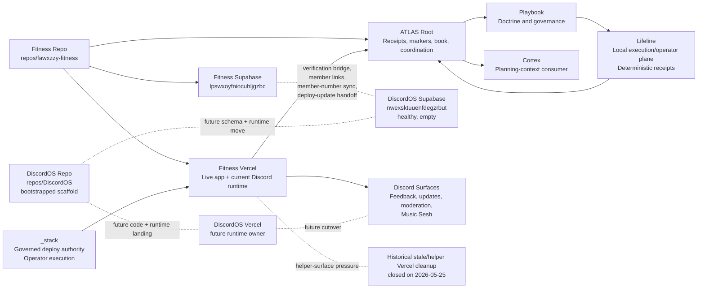

# Current System Map / Graph

## Purpose

This chapter is the compact cross-system map for the current stack.

It shows:

- which repos exist and who owns them
- which runtime and data surfaces are live today
- which future surfaces are planned but not active
- which contracts and approval gates block the next mutations

## Repo Map

### Current canonical repo surfaces

- `ATLAS`
  - stack coordination, receipts, markers, and book truth
- `repos/_stack`
  - governed deploy authority and shared operator execution
- `repos/fawxzzy-fitness`
  - Fitness app/runtime truth
  - current Discord-hosted runtime truth
- `repos/trove`
  - Trove repo-local runtime truth
- `repos/mazer`
  - Mazer repo-local runtime truth
- `repos/foundation`
  - Foundation repo-local runtime truth
- `repos/lifeline`
  - Lifeline repo-local operator and execution truth
  - manifest/runtime/release/startup/proof surface owner
- `repos/DiscordOS`
  - canonical DiscordOS repo surface now exists locally
  - governance scaffold only
  - no migrated runtime code yet

## Runtime Map

### Current live runtime shape

- Fitness Vercel hosts:
  - Fitness app runtime
  - current Discord interaction/runtime
  - current feedback/update/moderation runtime
  - current Music Sesh runtime
- Lifeline provides:
  - local execution/operator runtime for manifest-defined apps
  - manifest validation and resolution
  - local runtime lifecycle, release, startup, and proof surfaces
- `_stack` remains the governed deploy authority
- ATLAS root does not host product runtime
- ATLAS root may host bounded continuation-classification helpers such as the guarded Codex continuation gate, but those remain control-plane receipt surfaces rather than product runtime; even its admitted live-command path stays operator-enabled, wrapper-bound, preserves the historical packaged WindowsApps blocker as a machine-readable host-runtime boundary, proves the active npm-installed Codex CLI surface is non-packaged and launchable, records the narrower `resume_requires_stdin_prompt` blocker when the bare resume command starts without prompt payload, separately freezes the help-surface truth that the broader resume family exposes `[PROMPT]` plus dash-stdin support, admits only the smaller prompt-bearing branch `codex exec resume --last <inline-prompt>` while still deferring dash-stdin prompt injection, owns the timeout boundary inside the gate itself so one hung live proof yields `resume_command_timeout` instead of an outer-shell-only failure, and now closes the root ladder for that blocker class after the timeout-boundary recheck packet lands

### Future runtime shape

- Fitness runtime stays Fitness-owned
- Discord runtime moves to DiscordOS-owned surfaces later
- Lifeline stays a narrow local execution/operator plane rather than widening into a hosted control plane
- `_stack` remains shared deploy and execution authority

## Lifeline System Role

Use [Lifeline](15-lifeline.md) for the full Book-level boundary.

Current Lifeline role:

- local execution/operator plane
- manifest plus optional Playbook export consumer
- deterministic receipt and proof emitter
- ATLAS systems lane component

Current non-goals:

- hosted control plane
- multi-node orchestrator
- generic data platform

Later work stays clearly separate:

- Vercel/service-health classification
- deploy provenance visibility
- stale-surface pressure signals
- broader ATLAS-facing health projection

## Supabase Project Map

### Current

- Fitness Supabase: `lpswxoyfniocuhljgzbc`
  - live Fitness auth/profile truth
  - verification issuance truth
  - current live Discord/Music Sesh operational tables

### Future

- DiscordOS Supabase: `nwexsktuuenfdegzrbut`
  - healthy
  - empty
  - no schema landing implemented yet
  - future home for Discord-owned runtime/workflow tables

## Vercel Project Map

### Canonical active surfaces

- `fawxzzy-fitness`
  - current live operational hotspot
  - canonical Fitness runtime truth
- `fawxzzy-trove`
  - active product surface
- `fawxzzy-mazer`
  - quieter active product surface
- `fawxzzy-foundation`
  - quieter systems/product surface

### Known stale or duplicate-pressure surfaces

No helper Vercel project remains in the active live set after the 2026-05-25 helper-surface deletion pass.

Historical note:

- the stale Spotify-era Vercel projects were deleted on 2026-05-25 after dependency clearance
- the helper projects `fitness-deploy-green-panels` and `fitness-prod-rollout-20260525` were also deleted on 2026-05-25 after a clean dependency check

## DiscordOS / Fitness Shared-Seam Map

### Current shared seams

- verification bridge
- `discord_member_links`
- member-number sync
- deploy-to-update handoff
- current Discord/Music Sesh tables inside Fitness Supabase

### Future target posture

- Fitness keeps:
  - verification issuance
  - Fitness auth/profile truth
  - Fitness release proof
- DiscordOS later owns:
  - feedback runtime
  - update draft/publication runtime
  - moderation runtime
  - Music Sesh runtime

## `_stack` Command Ownership Map

`_stack` currently owns or should later own:

- governed deploy authority
- `stack validate` validation-summary command execution for ATLAS-owned validation posture
- admitted current-snapshot and delta-baseline validation-summary evidence discipline
- receipt-ready validation-summary report contract and contradiction routing
- bounded first validation-summary implementation slice plus proof-and-receipt closeout discipline
- `stack marker checkpoint` command execution for ATLAS-owned marker posture
- admitted marker-checkpoint restart-surface and cited-receipt discipline for ATLAS-owned marker posture
- receipt-ready marker-checkpoint report contract and contradiction routing for ATLAS-owned marker posture
- admitted marker-checkpoint implementation boundary and no-execution guard for ATLAS-owned marker posture
- bounded first marker-checkpoint implementation slice plus proof-and-receipt closeout discipline for ATLAS-owned marker posture
- admitted marker-checkpoint fixture/static proof boundary for ATLAS-owned marker posture
- admitted marker-checkpoint first implementation slice and proof matrix for ATLAS-owned marker posture
- admitted marker-checkpoint first implementation prompt-pack and handoff contract for ATLAS-owned marker posture
- admitted marker-checkpoint implementation-readiness closeout and worker-routing boundary for ATLAS-owned marker posture
- validation and receipt packaging helpers
- release-prep to deploy handoff
- stale-surface audit helpers
- future Vercel health classification helper

`_stack` does not own product or Discord runtime truth.

## Playbook Doctrine Flow

Current doctrine flow:

1. repeated receipt-backed rule appears in owner workflows
2. ATLAS records the pattern and convergence consequence
3. doctrine routing classifies it
4. operator-grade doctrine hardening ratifies only the receipt-backed, boundary-safe subset
5. restart and book mirrors may restate that doctrine without redefining it
6. Playbook later owns the reusable governance framing

Playbook does not become runtime owner at any step.

## Cortex Planning-Context Flow

Current planning-context flow:

1. ATLAS and receipt surfaces record durable state
2. ownership and seam docs create planning context
3. Cortex can later consume that planning context
4. Cortex does not currently mutate runtime or govern deploys

## Receipt / Proof Flow

Canonical flow:

1. owner repo or owner lane creates proof
2. `_stack` performs governed deploy where needed
3. owner repo records release or runtime proof
4. Discord publication consumes proof only after that
5. ATLAS records the cross-repo checkpoint
6. Playbook later extracts reusable doctrine

### Blocked consequence flow

When owner proof or release-readiness evidence freshness fails:

1. the owner repo stays not release-ready
2. `_stack` governed deploy authority stays blocked
3. owner release-ledger narration may record blocked state only
4. Discord publication stays blocked
5. ATLAS root may package blocked consequence only
6. blocked-work routing returns to the owner-side evidence-refresh packet

## Continuity / Retrieval Map

Retrieval-first continuity should be reconstructed in this order:

1. ATLAS canonical retrieval surfaces
   - marker table
   - receipt index
   - restart guide
   - system map
   - endgame surface
2. owner-repo truth-owner surfaces
   - repo READMEs
   - repo-owned workflow docs
   - repo-owned verification or adoption surfaces
3. governed summary and promotion surfaces
   - promoted doctrine notes
   - lane receipts
4. non-authoritative transcript residue last

Rule:

- ATLAS owns the retrieval spine
- owner repos own repo-local truth
- chat recap is optional nuance, not restart authority

## Approval-Gated Lanes

Current approval-gated lanes:

- remote preview / unfurl verification

Historical note:

- the Fitness Supabase mutation gate chain was fully exercised and then closed by `docs/ops/FITNESS-SUPABASE-PROFILE-DATA-HYGIENE-FINAL-CLOSEOUT-2026-05-25.md`
- any future Fitness Supabase work must reopen as a new, narrower lane instead of treating profile/data hygiene as still generally open

## Future Split

### Fitness app lane

- product and UX
- QA/LLEL
- local/mobile proof
- Fitness profile/data hygiene when approved

### Discord work lane

- DiscordOS
- bot/runtime
- feedback/update/moderation workflows
- Music Sesh
- DiscordOS Supabase

### ATLAS systems lane

- ATLAS root
- `_stack`
- Foundation
- Lifeline
- Playbook
- Cortex planning surfaces
- markers, receipts, validation, and governance automation

## System Graph

## Machine-Readable Appendix

| Lane / surface | Owner | Source of truth | Current status | Blocker | Next package |
| --- | --- | --- | --- | --- | --- |
| Fitness app lane | Fitness | `repos/fawxzzy-fitness` plus Fitness release proof | release-readiness lane now resting green on clean preserved truth | stale evidence, governed QA auth secret-lane consumption, protected-route auth consumption, seam-proof aborts, proof-run drift, the linked Supabase migration-validator crash, clean-state preservation, and the governed notes gate are now all cleared; no exact owner-side release-readiness blocker remains | none immediate inside the owner-side release-readiness family; await fresh root-bounded lane selection |
| Discord work lane | Fitness-hosted now, DiscordOS later | Fitness repo/runtime now; `repos/DiscordOS` plus ATLAS separation receipts as future target | scaffold complete, bridge-independent DiscordOS work may resume, but the old root named-port planning ladder is already consumed and live runtime migration has not started | live Fitness Discord proof still depends on external/session bridge recovery; the May 26 planning and lookup-boundary chain already consumed the old generic next-package class; higher-level authorization is still required before any transport-aware, externally-executing, schema, or runtime follow-on | `none by default at ATLAS root; reopen only on explicit new DiscordOS named scope or higher-level authorization` |
| ATLAS systems lane | ATLAS root plus `_stack` and Playbook boundaries | ATLAS docs, receipts, and canonical inventory surfaces | active governance lane now routes from the boundary-hardened Unified Workflow Convergence spine into `AI Repetition-to-Automation Pipeline`; validation summary and delta reporting remain the first safe family but are now closed at their current threshold for this slice, marker checkpoint rendering remains the selected second safe family and is now also closed at its current threshold for this slice with one exact ATLAS-side contract freeze plus one admitted `_stack` helper home plus one bounded `_stack` command-design spine plus one bounded `_stack` evidence-admission and restart-surface discipline spine plus one bounded `_stack` report-contract and contradiction-routing spine plus one bounded `_stack` implementation-admission and no-execution-guard spine plus one bounded `_stack` fixture/static-input proof spine plus one bounded `_stack` first-implementation-slice and proof-matrix spine plus one bounded `_stack` first-implementation prompt-pack and handoff-contract spine plus one bounded `_stack` implementation-readiness closeout and exact worker-routing spine plus one reconciled first implementation worker landing and one reconciled proof-and-receipt hardening follow-on, the first family remains backed by one bounded `_stack` command-design spine plus one bounded admitted-evidence and delta-baseline discipline spine plus one bounded report-contract/contradiction-routing spine plus one bounded implementation-admission/no-execution-guard spine plus one bounded fixture/static-input proof spine plus one bounded first-implementation-slice/proof-matrix spine plus one bounded first-implementation prompt-pack and handoff-contract spine plus one bounded implementation-readiness closeout and exact worker-routing spine plus one reconciled first implementation worker landing and one reconciled proof-and-receipt hardening follow-on, and `receipt skeleton and doctrine-routing drafts` is now the selected third safe family with one exact ATLAS-side contract freeze plus one exact split owner-facing admission boundary that now separates into `receipt skeleton drafts` and `doctrine-routing drafts`, with `receipt skeleton drafts` chosen as the first exact subfamily to advance and now carrying one exact bounded subfamily contract freeze plus one exact supporting-lane admission boundary plus one exact `_stack` command-design spine plus one exact evidence-admission spine plus one exact report-contract spine plus one exact implementation-admission spine plus one exact fixture-proof boundary spine plus one exact first-implementation-slice and proof-matrix spine plus one exact first-implementation prompt-pack and handoff-contract spine plus one exact implementation-readiness closeout and worker-routing spine plus one reconciled first implementation worker landing and one reconciled proof-and-receipt hardening follow-on, one bounded root-side restart-surface reconciliation packet now aligns the derivative mirrors for that scaffold path so filled-context draft packaging is restart-safe again, one bounded post-PR-73 merge closeout packet now clears the stale merged-main narration so the route no longer points at a closed PR family, one bounded scaffold-defaults packet now removes the remaining `REPLACE_ME_OBJECTIVE` / `REPLACE_ME_SCOPE` burden from the live helper for the current lane story, one bounded verification-defaults packet now removes the remaining `REPLACE_ME_VERIFICATION` burden from the live helper for the same draft-only lane story, one bounded date-defaults packet now removes the remaining routine same-day `--date` burden from that draft-only lane story, one bounded title-defaults packet now removes the remaining routine `--title` burden from that draft-only lane story, one bounded output-path-defaults packet now removes the remaining routine persisted-output path invention from that draft-only lane story while still keeping writes explicit, one bounded live default-write adoption checkpoint now proves that one operator command on canonical `main` can emit a durable agreed-context draft receipt with no placeholder objective, scope, verification, date, title, or output-path fields, one bounded post-PR-80 merge closeout packet now clears the stale merge-judgment restart truth while refreshing the live day-of scaffold proof on merged `main`, one bounded next-capability selection packet now ranks the remaining scaffold seams and selects current-lane default resolution as the next execution slice, one bounded current-lane default packet now proves the helper can read that lane from durable restart truth when `--lane` is omitted, PR `#83` is now merged and closed on `main`, one bounded post-PR-83 merge closeout packet now clears the stale merge-judgment restart truth while refreshing the live day-of scaffold proof on merged `main`, PR `#84` is now merged and closed on `main`, one bounded post-PR-84 merge closeout packet now clears the stale merge-judgment restart truth again while refreshing the live day-of scaffold proof on merged `main` so that branch family no longer advertises another pass by default, one bounded doctrine-routing subfamily contract-freeze packet now makes the deferred Playbook-side sibling restart-safe without implying doctrine admission or implementation authority, one bounded doctrine-routing owner-surface admission packet now admits Playbook as the exact future doctrine-facing home for that branch while ATLAS root retains truth projection and draft-only labeling, one bounded doctrine-routing supporting-lane decision packet now proves that no separate support seam honestly reopens from current truth so the third safe family closes at its current threshold, one bounded fourth-safe family selection packet now picks `release-proof to update-draft packaging helpers` as the strongest remaining safe family because the release-to-update handoff spine is already hardened while QA/LLEL proof-packet preparation remains the more proof-shape-sensitive deferred helper, one bounded fourth-family contract-freeze packet now makes that release-proof packaging seam restart-safe without implying proof creation, deploy approval, publication approval, or final update wording authority, one bounded fourth-family owner-surface admission packet now admits `_stack` as the exact helper home for that seam while keeping owner proof upstream and Discord-facing draft/publish surfaces downstream consumers only, and one bounded fourth-family supporting-lane admission packet now admits `_stack Readiness` as the exact direct support lane because future helper-home work for this seam must route through one shared `_stack` command surface rather than ATLAS-only truth packaging | the verification bridge seam remains frozen as an external/session-scoped Codex-to-Chrome blocker outside this lane; root validation posture should still be treated conservatively because recent repeated foreground and background `validate_stack.py --ratchet` attempts have not completed cleanly in-session, unrelated Trove brand-consumer verify drift remains outside this lane, archive follow-on, Operator Secret Path Hygiene, Playbook Everywhere + Cortex Interface, Durable Context Externalization, Knowledge Capture & Transfer, Inventory & Truth Map, Truth Map & ATLAS Book, Local Data Gateway, `Unified Workflow Convergence`, the materially closed `stabilize-root-worktree` root-docs ladder, Cortex authority widening, and Atlas-owned Repo Naming Canonicalization all remain held rather than reopened; `_stack Readiness` now supports the first two admitted families plus the held receipt-skeleton subfamily and the newly admitted fourth-family release-proof packaging seam, Playbook Everywhere + Cortex Interface remains materially held rather than reopened because no new exportable family, cleared blocked family, or contract drift appeared here, and ratchet authority remains in ATLAS | `_stack Readiness stack update draft command-design pass 47` |
| Post-convergence lane split readiness | ATLAS root | lane-split receipts plus ATLAS Book restart surfaces | open at `61%`; one compact lane-owned decisive receipt spine, one fully shaped blocker-family chain, one manifest-backed continuity map, and a shaped chain that has now passed one coherent refresh cycle as a single restart unit | no immediate docs-only blocker family remains inside the lane | no immediate docs-only follow-on packet; reopen only with a distinct restart-truth, marker, approval, or execution-surface change |
| Fitness Supabase hygiene | Fitness | Fitness Supabase plus ATLAS closeout and governance receipts | closed at `100%`; remaining Discord/Music Sesh concerns transferred out of lane scope | none inside Fitness profile-core cleanup scope | defer any Discord/Music Sesh follow-on to Discord OS Infrastructure Separation |
| DiscordOS bootstrap | DiscordOS | `repos/DiscordOS` | completed with governance scaffold only | no migrated code yet | bounded post-bootstrap implementation plan |
| Helper Vercel decommission | ATLAS systems lane with owner confirmation | Vercel inventory and deletion receipts | stale Spotify-era and helper Fitness projects deleted | provenance clarity and future health classification only | preview/unfurl verification or Vercel health-design lane |
| Lifeline local execution/operator plane | Lifeline | `repos/lifeline` plus repo-local README, architecture, operator-surface, and startup-contract docs | shipped as a narrow local-first execution plane for manifest validation/resolution, runtime lifecycle, release, startup, proof, and deterministic receipts; consumes optional Playbook exports from disk and emits ATLAS-visible consequence without becoming a hosted control plane | broader Vercel/service-health classification, deploy provenance visibility, stale-surface pressure signals, and richer ATLAS-facing health projection remain later work; `_stack` still owns governed deploy authority | start with [Lifeline](15-lifeline.md), then the Lifeline repo truth surfaces; no immediate root-only Lifeline mutation packet is opened by this Book pass |

## Non-Goals

- no repo creation
- no code movement
- no data migration
- no Vercel mutation
- no Discord runtime change
