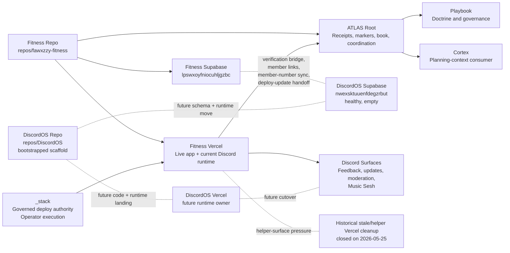

# Current System Map / Graph

## Purpose

This chapter is the compact cross-system map for the current stack.

It shows:

- which repos exist and who owns them
- which runtime and data surfaces are live today
- which future surfaces are planned but not active
- which contracts and approval gates block the next mutations

## Repo Map

### Current canonical repo surfaces

- `ATLAS`
  - stack coordination, receipts, markers, and book truth
- `repos/_stack`
  - governed deploy authority and shared operator execution
- `repos/fawxzzy-fitness`
  - Fitness app/runtime truth
  - current Discord-hosted runtime truth
- `repos/trove`
  - Trove repo-local runtime truth
- `repos/mazer`
  - Mazer repo-local runtime truth
- `repos/foundation`
  - Foundation repo-local runtime truth
- `repos/DiscordOS`
  - canonical DiscordOS repo surface now exists locally
  - governance scaffold only
  - no migrated runtime code yet

## Runtime Map

### Current live runtime shape

- Fitness Vercel hosts:
  - Fitness app runtime
  - current Discord interaction/runtime
  - current feedback/update/moderation runtime
  - current Music Sesh runtime
- `_stack` remains the governed deploy authority
- ATLAS root does not host product runtime

### Future runtime shape

- Fitness runtime stays Fitness-owned
- Discord runtime moves to DiscordOS-owned surfaces later
- `_stack` remains shared deploy and execution authority

## Supabase Project Map

### Current

- Fitness Supabase: `lpswxoyfniocuhljgzbc`
  - live Fitness auth/profile truth
  - verification issuance truth
  - current live Discord/Music Sesh operational tables

### Future

- DiscordOS Supabase: `nwexsktuuenfdegzrbut`
  - healthy
  - empty
  - no schema landing implemented yet
  - future home for Discord-owned runtime/workflow tables

## Vercel Project Map

### Canonical active surfaces

- `fawxzzy-fitness`
  - current live operational hotspot
  - canonical Fitness runtime truth
- `fawxzzy-trove`
  - active product surface
- `fawxzzy-mazer`
  - quieter active product surface
- `fawxzzy-foundation`
  - quieter systems/product surface

### Known stale or duplicate-pressure surfaces

No helper Vercel project remains in the active live set after the 2026-05-25 helper-surface deletion pass.

Historical note:

- the stale Spotify-era Vercel projects were deleted on 2026-05-25 after dependency clearance
- the helper projects `fitness-deploy-green-panels` and `fitness-prod-rollout-20260525` were also deleted on 2026-05-25 after a clean dependency check

## DiscordOS / Fitness Shared-Seam Map

### Current shared seams

- verification bridge
- `discord_member_links`
- member-number sync
- deploy-to-update handoff
- current Discord/Music Sesh tables inside Fitness Supabase

### Future target posture

- Fitness keeps:
  - verification issuance
  - Fitness auth/profile truth
  - Fitness release proof
- DiscordOS later owns:
  - feedback runtime
  - update draft/publication runtime
  - moderation runtime
  - Music Sesh runtime

## `_stack` Command Ownership Map

`_stack` currently owns or should later own:

- governed deploy authority
- validation and receipt packaging helpers
- release-prep to deploy handoff
- stale-surface audit helpers
- future Vercel health classification helper

`_stack` does not own product or Discord runtime truth.

## Playbook Doctrine Flow

Current doctrine flow:

1. repeated receipt-backed rule appears in owner workflows
2. ATLAS records the pattern and convergence consequence
3. doctrine routing classifies it
4. operator-grade doctrine hardening ratifies only the receipt-backed, boundary-safe subset
5. restart and book mirrors may restate that doctrine without redefining it
6. Playbook later owns the reusable governance framing

Playbook does not become runtime owner at any step.

## Cortex Planning-Context Flow

Current planning-context flow:

1. ATLAS and receipt surfaces record durable state
2. ownership and seam docs create planning context
3. Cortex can later consume that planning context
4. Cortex does not currently mutate runtime or govern deploys

## Receipt / Proof Flow

Canonical flow:

1. owner repo or owner lane creates proof
2. `_stack` performs governed deploy where needed
3. owner repo records release or runtime proof
4. Discord publication consumes proof only after that
5. ATLAS records the cross-repo checkpoint
6. Playbook later extracts reusable doctrine

### Blocked consequence flow

When owner proof or release-readiness evidence freshness fails:

1. the owner repo stays not release-ready
2. `_stack` governed deploy authority stays blocked
3. owner release-ledger narration may record blocked state only
4. Discord publication stays blocked
5. ATLAS root may package blocked consequence only
6. blocked-work routing returns to the owner-side evidence-refresh packet

## Continuity / Retrieval Map

Retrieval-first continuity should be reconstructed in this order:

1. ATLAS canonical retrieval surfaces
   - marker table
   - receipt index
   - restart guide
   - system map
   - endgame surface
2. owner-repo truth-owner surfaces
   - repo READMEs
   - repo-owned workflow docs
   - repo-owned verification or adoption surfaces
3. governed summary and promotion surfaces
   - promoted doctrine notes
   - lane receipts
4. non-authoritative transcript residue last

Rule:

- ATLAS owns the retrieval spine
- owner repos own repo-local truth
- chat recap is optional nuance, not restart authority

## Approval-Gated Lanes

Current approval-gated lanes:

- remote preview / unfurl verification

Historical note:

- the Fitness Supabase mutation gate chain was fully exercised and then closed by `docs/ops/FITNESS-SUPABASE-PROFILE-DATA-HYGIENE-FINAL-CLOSEOUT-2026-05-25.md`
- any future Fitness Supabase work must reopen as a new, narrower lane instead of treating profile/data hygiene as still generally open

## Future Split

### Fitness app lane

- product and UX
- QA/LLEL
- local/mobile proof
- Fitness profile/data hygiene when approved

### Discord work lane

- DiscordOS
- bot/runtime
- feedback/update/moderation workflows
- Music Sesh
- DiscordOS Supabase

### ATLAS systems lane

- ATLAS root
- `_stack`
- Foundation
- Lifeline
- Playbook
- Cortex planning surfaces
- markers, receipts, validation, and governance automation

## System Graph

## Machine-Readable Appendix

| Lane / surface | Owner | Source of truth | Current status | Blocker | Next package |
| --- | --- | --- | --- | --- | --- |
| Fitness app lane | Fitness | `repos/fawxzzy-fitness` plus Fitness release proof | release-readiness lane now resting green on clean preserved truth | stale evidence, governed QA auth secret-lane consumption, protected-route auth consumption, seam-proof aborts, proof-run drift, the linked Supabase migration-validator crash, clean-state preservation, and the governed notes gate are now all cleared; no exact owner-side release-readiness blocker remains | none immediate inside the owner-side release-readiness family; await fresh root-bounded lane selection |
| Discord work lane | Fitness-hosted now, DiscordOS later | Fitness repo/runtime now; `repos/DiscordOS` plus ATLAS separation receipts as future target | scaffold complete, lookup widening explicitly closed, runtime migration not started | higher-level authorization is required before any transport-aware, externally-executing, schema, or runtime follow-on | none inside the current lookup lane; reopen only through explicit higher-level authorization |
| ATLAS systems lane | ATLAS root plus `_stack` and Playbook boundaries | ATLAS docs, receipts, and canonical inventory surfaces | active governance lane with a boundary-hardened Unified Workflow Convergence spine on top of the current inventory and book substrate | the verification bridge seam no longer depends on Fitness repo/runtime repair and remains frozen as an external/session-scoped Codex-to-Chrome bridge blocker outside this lane; archive follow-on, Operator Secret Path Hygiene, Playbook Everywhere + Cortex Interface, Durable Context Externalization, Knowledge Capture & Transfer, Inventory & Truth Map, Truth Map & ATLAS Book, Local Data Gateway, the materially closed `stabilize-root-worktree` root-docs ladder, Cortex authority widening, and Atlas-owned Repo Naming Canonicalization all remain held rather than reopened | no immediate supporting lane is open; reopen support only if one direct dependency is admitted by the active Unified Workflow Convergence slice |
| Post-convergence lane split readiness | ATLAS root | lane-split receipts plus ATLAS Book restart surfaces | open at `61%`; one compact lane-owned decisive receipt spine, one fully shaped blocker-family chain, one manifest-backed continuity map, and a shaped chain that has now passed one coherent refresh cycle as a single restart unit | no immediate docs-only blocker family remains inside the lane | no immediate docs-only follow-on packet; reopen only with a distinct restart-truth, marker, approval, or execution-surface change |
| Fitness Supabase hygiene | Fitness | Fitness Supabase plus ATLAS closeout and governance receipts | closed at `100%`; remaining Discord/Music Sesh concerns transferred out of lane scope | none inside Fitness profile-core cleanup scope | defer any Discord/Music Sesh follow-on to Discord OS Infrastructure Separation |
| DiscordOS bootstrap | DiscordOS | `repos/DiscordOS` | completed with governance scaffold only | no migrated code yet | bounded post-bootstrap implementation plan |
| Helper Vercel decommission | ATLAS systems lane with owner confirmation | Vercel inventory and deletion receipts | stale Spotify-era and helper Fitness projects deleted | provenance clarity and future health classification only | preview/unfurl verification or Vercel health-design lane |
| Lifeline health projection | Lifeline later, `_stack` first | current Vercel and stack health receipts | pressure identified; `_stack`-first command design, evidence-admission rules, report contract, implementation guard, fixture/static-proof boundary, first implementation slice, worker handoff contract, readiness closeout, and the first proof-hardening follow-on are now all frozen or reconciled | no immediate root-only `_stack` follow-on is open for this first slice; future movement requires a broader implementation slice, a lock-refresh lane, or a changed guard boundary rather than more first-slice seam design | none immediate docs-only; reopen only on broader implementation, lock-refresh, or guard-boundary change |

## Non-Goals

- no repo creation
- no code movement
- no data migration
- no Vercel mutation
- no Discord runtime change
