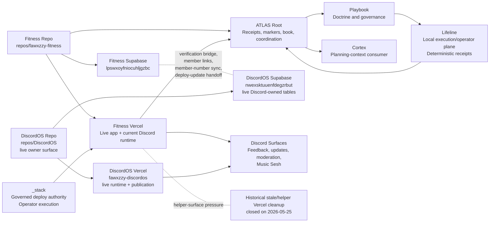

# Current System Map / Graph

## Purpose

This chapter is the compact cross-system map for the current stack.

It shows:

- which repos exist and who owns them
- which runtime and data surfaces are live today
- which future surfaces are planned but not active
- which contracts and approval gates block the next mutations

## Repo Map

### Current canonical repo surfaces

- `ATLAS`
  - stack coordination, receipts, markers, and book truth
- `repos/_stack`
  - governed deploy authority and shared operator execution
- `repos/fawxzzy-fitness`
  - Fitness app/runtime truth
  - current Discord-hosted runtime truth
- `repos/trove`
  - Trove repo-local runtime truth
- `repos/mazer`
  - Mazer repo-local runtime truth
- `repos/foundation`
  - Foundation repo-local runtime truth
- `repos/lifeline`
  - Lifeline repo-local operator and execution truth
  - manifest/runtime/release/startup/proof surface owner
- `repos/DiscordOS`
  - canonical DiscordOS repo surface now exists locally
  - live DiscordOS runtime, publication, and feedback owner surface
  - runtime-health and operator-proof surface owner

## Runtime Map

### Current live runtime shape

- Fitness Vercel hosts:
  - Fitness app runtime
  - retained Fitness Discord interaction/runtime seams
  - retained verification, member-sync, deploy-update, and poll-path execution seams
- DiscordOS Vercel hosts:
  - live DiscordOS feedback/runtime/publication surfaces
  - live runtime-health and alerting surfaces
  - broader Discord-owned workflow runtime
- Lifeline provides:
  - local execution/operator runtime for manifest-defined apps
  - manifest validation and resolution
  - local runtime lifecycle, release, startup, and proof surfaces
- `_stack` remains the governed deploy authority
- ATLAS root does not host product runtime
- ATLAS root now also owns one bounded local-only Sandbox simulation substrate under `data/atlas/sandbox/**` and `runtime/atlas/sandbox/**`; that substrate now includes one admitted example scenario manifest, one paired fixture-pack, one note-only fixture, one input fixture stub, one expected-output fixture stub, one frozen validator-boundary contract, one committed validator descriptor stub, one frozen validator-report contract, one committed validator-report stub, one frozen validator-status-semantics contract, one frozen validator-comparison boundary, one frozen validator-candidate-output shape, one committed validator-candidate-output stub, one frozen validator-candidate-output report link, one frozen validator-pair coherence semantic layer, one frozen validator-verdict activation gate, one frozen validator-behavior boundary, one admitted root-local validator-behavior owner surface, one admitted supporting-lane decision held at `none yet`, one admitted first pre-verdict implementation slice, one admitted worker handoff contract, one admitted implementation-readiness routing checkpoint, and one reconciled first implementation landing, but it still admits no executed validator verdict activation, runner, `_stack`, owner-repo, deploy, secret, or live-data widening
- ATLAS root may host bounded continuation-classification helpers such as the guarded Codex continuation gate, but those remain control-plane receipt surfaces rather than product runtime; even its admitted live-command path stays operator-enabled, wrapper-bound, preserves the historical packaged WindowsApps blocker as a machine-readable host-runtime boundary, proves the active npm-installed Codex CLI surface is non-packaged and launchable, records the narrower `resume_requires_stdin_prompt` blocker when the bare resume command starts without prompt payload, separately freezes the help-surface truth that the broader resume family exposes `[PROMPT]` plus dash-stdin support, admits only the smaller prompt-bearing branch `codex exec resume --last <inline-prompt>` while still deferring dash-stdin prompt injection, owns the timeout boundary inside the gate itself so one hung live proof yields `resume_command_timeout` instead of an outer-shell-only failure, and now closes the root ladder for that blocker class after the timeout-boundary recheck packet lands

### Future runtime shape

- Fitness runtime stays Fitness-owned
- retained Fitness Discord seams stay Fitness-owned unless a new owner-scope transfer is explicitly admitted
- broader Discord runtime already lives on DiscordOS-owned surfaces
- Lifeline stays a narrow local execution/operator plane rather than widening into a hosted control plane
- `_stack` remains shared deploy and execution authority

## Lifeline System Role

Use [Lifeline](15-lifeline.md) for the full Book-level boundary.

Current Lifeline role:

- local execution/operator plane
- manifest plus optional Playbook export consumer
- deterministic receipt and proof emitter
- ATLAS systems lane component

Current non-goals:

- hosted control plane
- multi-node orchestrator
- generic data platform

Later work stays clearly separate:

- Vercel/service-health classification
- deploy provenance visibility
- stale-surface pressure signals
- broader ATLAS-facing health projection

## Supabase Project Map

### Current

- Fitness Supabase: `lpswxoyfniocuhljgzbc`
  - live Fitness auth/profile truth
  - verification issuance truth
  - current live Discord/Music Sesh operational tables

### Active Discord-owned surface / future broader ownership

- DiscordOS Supabase: `nwexsktuuenfdegzrbut`
  - healthy
  - private schema `discordos` exists
  - RLS-enabled feedback runtime contract tables exist
  - Supabase Edge Function `discordos-readiness` is active with JWT verification
  - service-role readiness proof is live through the Supabase Edge Function path
  - live feedback transfer, rollback, and workflow parity proof are already closed
  - active home for Discord-owned feedback workflow tables
  - future home for broader Discord-owned runtime/workflow tables

## Vercel Project Map

### Canonical active surfaces

- `fawxzzy-fitness`
  - current live operational hotspot
  - canonical Fitness runtime truth
- `fawxzzy-trove`
  - active product surface
- `fawxzzy-mazer`
  - quieter active product surface
- `fawxzzy-foundation`
  - quieter systems/product surface
- `fawxzzy-discordos`
  - live DiscordOS production surface
  - canonical alias `https://fawxzzy-discordos.vercel.app`
  - service-role readiness now validates JWT role and DiscordOS project ref before reporting configured
  - service-role proof path is live through Supabase Edge Function runtime
  - Discord bot credential now validates through a read-only `/users/@me` readiness probe
  - activation guard is live and fail-closed for writer, traffic-transfer, rollback, and parity-proof gates
  - feedback cutover is proof-closed, with live transfer, rollback, and parity proof already admitted
  - publication and runtime-health surfaces are live and operator-verified
  - retained Fitness-owned Discord seams remain outside this closed surface unless a new transfer lane is admitted

### Known stale or duplicate-pressure surfaces

No helper Vercel project remains in the active live set after the 2026-05-25 helper-surface deletion pass.

Historical note:

- the stale Spotify-era Vercel projects were deleted on 2026-05-25 after dependency clearance
- the helper projects `fitness-deploy-green-panels` and `fitness-prod-rollout-20260525` were also deleted on 2026-05-25 after a clean dependency check

## DiscordOS / Fitness Shared-Seam Map

### Current shared seams

- verification bridge
- `discord_member_links`
- member-number sync
- deploy-to-update handoff
- current Discord/Music Sesh tables inside Fitness Supabase

### Future target posture

- Fitness keeps:
  - verification issuance
  - Fitness auth/profile truth
  - Fitness release proof
- DiscordOS later owns:
  - feedback runtime
  - update draft/publication runtime
  - moderation runtime
  - Music Sesh runtime

## `_stack` Command Ownership Map

`_stack` currently owns or should later own:

- governed deploy authority
- `stack validate` validation-summary command execution for ATLAS-owned validation posture
- admitted current-snapshot and delta-baseline validation-summary evidence discipline
- receipt-ready validation-summary report contract and contradiction routing
- bounded first validation-summary implementation slice plus proof-and-receipt closeout discipline
- `stack marker checkpoint` command execution for ATLAS-owned marker posture
- admitted marker-checkpoint restart-surface and cited-receipt discipline for ATLAS-owned marker posture
- receipt-ready marker-checkpoint report contract and contradiction routing for ATLAS-owned marker posture
- admitted marker-checkpoint implementation boundary and no-execution guard for ATLAS-owned marker posture
- bounded first marker-checkpoint implementation slice plus proof-and-receipt closeout discipline for ATLAS-owned marker posture
- admitted marker-checkpoint fixture/static proof boundary for ATLAS-owned marker posture
- admitted marker-checkpoint first implementation slice and proof matrix for ATLAS-owned marker posture
- admitted marker-checkpoint first implementation prompt-pack and handoff contract for ATLAS-owned marker posture
- admitted marker-checkpoint implementation-readiness closeout and worker-routing boundary for ATLAS-owned marker posture
- validation and receipt packaging helpers
- release-prep to deploy handoff
- stale-surface audit helpers
- future Vercel health classification helper

`_stack` does not own product or Discord runtime truth.

## Playbook Doctrine Flow

Current doctrine flow:

1. repeated receipt-backed rule appears in owner workflows
2. ATLAS records the pattern and convergence consequence
3. doctrine routing classifies it
4. operator-grade doctrine hardening ratifies only the receipt-backed, boundary-safe subset
5. restart and book mirrors may restate that doctrine without redefining it
6. Playbook later owns the reusable governance framing

Playbook does not become runtime owner at any step.

## Cortex Planning-Context Flow

Current planning-context flow:

1. ATLAS and receipt surfaces record durable state
2. ownership and seam docs create planning context
3. Cortex can later consume that planning context
4. Cortex does not currently mutate runtime or govern deploys

## Receipt / Proof Flow

Canonical flow:

1. owner repo or owner lane creates proof
2. `_stack` performs governed deploy where needed
3. owner repo records release or runtime proof
4. Discord publication consumes proof only after that
5. ATLAS records the cross-repo checkpoint
6. Playbook later extracts reusable doctrine

### Blocked consequence flow

When owner proof or release-readiness evidence freshness fails:

1. the owner repo stays not release-ready
2. `_stack` governed deploy authority stays blocked
3. owner release-ledger narration may record blocked state only
4. Discord publication stays blocked
5. ATLAS root may package blocked consequence only
6. blocked-work routing returns to the owner-side evidence-refresh packet

## Continuity / Retrieval Map

Retrieval-first continuity should be reconstructed in this order:

1. ATLAS canonical retrieval surfaces
   - marker table
   - receipt index
   - restart guide
   - system map
   - endgame surface
   - seeded initiative manifest health via `ops/atlas/continuity_manifest_health.py` or the awareness slice `continuity_initiative_manifest_health`; current seeded-set posture is `19 ok / 0 warning / 0 error`
   - eligible open-marker manifest coverage via `ops/atlas/continuity_open_marker_manifest_coverage.py` or the awareness slice `continuity_open_marker_manifest_coverage`; current posture is `7 / 7` eligible open markers manifest-backed
   - eligible open-marker restart index via `ops/atlas/continuity_open_marker_restart_index.py` or the awareness slice `continuity_open_marker_restart_index`; current posture is `7 / 7` eligible open markers restart-ready from one machine-readable index
   - maintained-manifest restart index via `ops/atlas/continuity_maintained_manifest_restart_index.py` or the awareness slice `continuity_maintained_manifest_restart_index`; current posture is `19 / 19` maintained initiative manifests restart-ready from one machine-readable index
2. owner-repo truth-owner surfaces
   - repo READMEs
   - repo-owned workflow docs
   - repo-owned verification or adoption surfaces
3. governed summary and promotion surfaces
   - promoted doctrine notes
   - lane receipts
4. non-authoritative transcript residue last

Rule:

- ATLAS owns the retrieval spine
- owner repos own repo-local truth
- chat recap is optional nuance, not restart authority

## Approval-Gated Lanes

Current approval-gated lanes:

- remote preview / unfurl verification

Historical note:

- the Fitness Supabase mutation gate chain was fully exercised and then closed by `docs/ops/FITNESS-SUPABASE-PROFILE-DATA-HYGIENE-FINAL-CLOSEOUT-2026-05-25.md`
- any future Fitness Supabase work must reopen as a new, narrower lane instead of treating profile/data hygiene as still generally open

## Future Split

### Fitness app lane

- product and UX
- QA/LLEL
- local/mobile proof
- Fitness profile/data hygiene when approved

### Discord work lane

- DiscordOS
- bot/runtime
- feedback/update/moderation workflows
- Music Sesh
- DiscordOS Supabase

### ATLAS systems lane

- ATLAS root
- `_stack`
- Foundation
- Lifeline
- Playbook
- Cortex planning surfaces
- markers, receipts, validation, and governance automation
- latest ATLAS-root immediate lane packet:
- `No immediate ATLAS-root packet is open`
  - superseding current-family update: the AI Long-Run downstream chain remains durably held through the post-stack-command-implementation-actual-owner-side-mutation-authority-class-value downstream hold recheck, the root-bounded lane-selection closeout now routes the active ATLAS-side lane into Sandbox, the prompt-pack and handoff contract is already exact, the implementation-readiness closeout is already exact, the bounded validator-behavior helper landing is now reconciled on canonical `main`, the post-behavior next-slice selector is now durable, the helper-to-boundary link contract is now durable, the verdict-assignment rule contract is now durable, the verdict-activation reopening rule contract is now durable, the report-status activation mapping contract is now durable, the report-status activation gate contract is now durable, the report-result mutation boundary contract is now durable, the candidate-output verdict-artifact mutation boundary contract is now durable, the paired-artifact writeback boundary contract is now durable, the report-and-candidate-output synchronization boundary contract is now durable, the verdict-bearing artifact activation gate contract is now durable, the synchronized artifact writeback boundary contract is now durable, the validator-execution admission boundary contract is now durable, the runner-behavior admission boundary contract is now durable, the `_stack`-routing admission boundary contract is now durable, the owner-surface execution admission boundary contract is now durable, the deploy-surface runtime admission boundary contract is now durable, the unattended-runtime proof admission boundary contract is now durable, the publication-surface claim admission boundary contract is now durable, the live-unattended execution admission boundary contract is now durable, the secret-bearing automation admission boundary contract is now durable, the deploy-surface mutation admission boundary contract is now durable, the public-release-truth admission boundary contract is now durable, the owner-repo-mutation admission boundary contract is now durable, the actual-owner-side-mutation admission boundary contract is now durable, the live-owner-repo-edits admission boundary contract is now durable, the deploy-execution admission boundary contract is now durable, the broader-runtime-assertions admission boundary contract is now durable, and the new top-level dispatcher closeout now freezes that the current Sandbox family stays held and no immediate ATLAS-root packet is honestly open
  - prior active-family carry-forward: `Sandbox Simulation Readiness local-only first validator broader runtime assertions admission boundary contract freeze` remains restart-relevant history, but it is no longer the current immediate lane packet because the same-lane next package is explicitly `No immediate Sandbox Simulation Readiness same-lane packet`
  - prior active-family carry-forward: `Sandbox Simulation Readiness post-local-only first validator broader-runtime-assertions admission boundary hold or top-level lane reselection` remains the decisive current-family hold receipt, but the new top-level dispatcher closeout now carries the broader root truth that `No immediate ATLAS-root packet is open`
  - prior active-family carry-forward: `AI Long-Run Batch Orchestration post-stack-command-implementation-actual-owner-side-mutation-authority-class-value downstream hold recheck` remains restart-relevant history, but it is no longer the current immediate lane packet because the same-lane next package is explicitly `No immediate AI Long-Run Batch Orchestration same-lane packet`
- current bounded seam progression:
  - retained-state descendant-layout contract freeze -> owner-surface admission -> supporting-lane hold at `none yet` -> first-implementation admission -> prompt-pack and handoff contract -> implementation-readiness closeout -> reconciled first implementation landing -> queue-home or registry-home reselection -> queue-home or registry-home contract freeze -> owner-surface admission -> supporting-lane hold at `none yet` -> first-implementation admission -> prompt-pack and handoff contract -> implementation-readiness closeout -> reconciled first implementation landing -> child-path or artifact-shape reselection -> child-path or artifact-shape contract freeze -> owner-surface admission -> supporting-lane hold at `none yet` -> first-implementation admission -> prompt-pack and handoff contract -> implementation-readiness closeout -> reconciled first implementation landing -> worker-artifact emission -> execution-bridge artifacts -> queue-drop emission -> launch-or-dispatch behavior -> claim-state movement -> done-state closure -> merge-request artifact behavior -> paused-status artifact behavior -> merger-assignment artifact behavior -> resume-context artifact behavior -> merge-completion behavior -> root-owned resume request or dispatch behavior -> broader queue-state history read model -> runtime-state discovery inventory -> supervisor runtime inventory -> execution-home runtime inventory -> canonical execution receipt selection -> canonical execution receipt writeback -> supervisor merge-request lineage selection -> provenance status surface hardening -> provenance-alert severity routing decision -> provenance-alert queue-proof and payload-boundary hardening -> provenance-alert render-status payload integration proof -> provenance-alert queue-signal budget decision -> provenance-alert queue-signal budget integration proof -> provenance-alert queue-signal budget restart truth receipt -> provenance-alert queue-signal budget next-slice selection -> provenance-alert top-level summary boundary contract freeze -> provenance-alert top-level summary boundary owner-surface admission -> provenance-alert top-level summary boundary supporting-lane hold at `none yet` -> provenance-alert top-level summary boundary first-implementation admission -> provenance-alert top-level summary boundary prompt-pack and handoff contract -> provenance-alert top-level summary boundary implementation-readiness closeout and worker-routing -> provenance-alert top-level summary boundary reconciled first implementation landing -> post-provenance-alert top-level summary boundary next-slice selection -> broader attention_queue semantics beyond provenance alerts contract freeze -> broader attention_queue semantics beyond provenance alerts owner-surface admission -> broader attention_queue semantics beyond provenance alerts supporting-lane hold at `none yet` -> broader attention_queue semantics beyond provenance alerts first-implementation admission -> broader attention_queue semantics beyond provenance alerts prompt-pack and handoff contract -> broader attention_queue semantics beyond provenance alerts implementation-readiness closeout and worker-routing -> broader attention_queue semantics beyond provenance alerts reconciled first implementation landing -> post-broader attention_queue semantics beyond provenance alerts next-slice selection -> broader attention_queue conversation_action_request contract freeze -> broader attention_queue conversation_action_request owner-surface admission -> broader attention_queue conversation_action_request supporting-lane hold at `none yet` -> broader attention_queue conversation_action_request first-implementation admission -> broader attention_queue conversation_action_request prompt-pack and handoff contract -> broader attention_queue conversation_action_request implementation-readiness closeout and worker-routing -> broader attention_queue conversation_action_request reconciled first implementation landing -> post-broader attention_queue conversation_action_request next-slice selection -> broader attention_queue quarantined_trust_surface contract freeze -> broader attention_queue quarantined_trust_surface owner-surface admission -> broader attention_queue quarantined_trust_surface supporting-lane hold at `none yet` -> broader attention_queue quarantined_trust_surface first-implementation admission -> broader attention_queue quarantined_trust_surface prompt-pack and handoff contract -> broader attention_queue quarantined_trust_surface implementation-readiness closeout and worker-routing -> broader attention_queue quarantined_trust_surface reconciled first implementation landing -> post-broader attention_queue quarantined_trust_surface next-slice selection -> broader attention_queue registry_error contract freeze -> broader attention_queue registry_error owner-surface admission -> broader attention_queue registry_error supporting-lane admission

## System Graph

## Machine-Readable Appendix

| Lane / surface | Owner | Source of truth | Current status | Blocker | Next package |
| --- | --- | --- | --- | --- | --- |
| Fitness app lane | Fitness | `repos/fawxzzy-fitness` plus protected QA read-model receipts | adopted protected-QA topology is repaired and current: `playbook`, `trove`, `foundation`, and `lifeline` are release-ready, `fitness` is now clean on branch `codex/fitness-main-progression-summary-reapply` at commit `b5f29793eb87dc7538a15160180f159688acd1b4`, the ATLAS root is now clean on `main` at commit `28cde650d1228da14e659fe27f009e4084711317`, published inventory now shows zero dirty managed repos, `stream` is visible as `not_applicable` because it is not release-eligible, the BrowserStack provider control plane remains valid for `desktop.chromium.real`, `android.chrome.real`, and `iphone.webkit.real`, protected dispatch run `28315893818` proved adapter bootstrap plus sparse validation on GitHub Actions, and `runtime/atlas/qa/github-secret-readiness.latest.json` now keeps the ATLAS repo secret-name posture machine-readable with `available_secret_count: 0` | the current protected-refresh republish is no longer blocked by stale command routing, emulated visual diffs, dirty-worktree source ambiguity, stale target-SHA truth, or hosted-dispatch bootstrap/validation drift, and `desktop.chromium.real.manual` is now valid on the current protected run; the remaining live blocker is only `android.chrome.real` plus `iphone.webkit.real` plus missing ATLAS GitHub Actions secrets `BROWSERSTACK_USERNAME` and `BROWSERSTACK_ACCESS_KEY`, as proved by protected dispatch run `28316073769` and the secret-readiness audit | Complete Android and iPhone real-device proof or manual attestation for `fitness`, restore ATLAS GitHub Actions BrowserStack secrets, or run one protected BrowserStack pass once those upstream credentials exist again; reopen `stream` only if stack governance later promotes it into release scope |
| Discord work lane | retained Fitness seams plus live DiscordOS owner surfaces | retained Fitness repo/runtime seams now; `repos/DiscordOS` plus DiscordOS production/runtime receipts for the broader Discord-owned surface | feedback transfer cutover, publication, and runtime-hardening are already live and proof-closed; remaining Fitness-owned Discord seams are explicit retained boundaries rather than migration debt | none inside the closed feedback/publication/runtime-hardening lanes; reopen only with a new named DiscordOS scope or higher-level authorization | `none by default at ATLAS root; reopen only on explicit new DiscordOS named scope or higher-level authorization` |
| Post-convergence lane split readiness | ATLAS root | lane-split receipts plus ATLAS Book restart surfaces | closed at `100%`; the dedicated Fitness poll surface is live on production, consumed by the governed recurring worker path, and no longer acts as one mixed-runtime lane-structure ambiguity | none inside the current closed lane | none immediate; reopen only with a new owner-boundary ambiguity, retained-seam regression, or materially different runtime change |
| Fitness Supabase hygiene | Fitness | Fitness Supabase plus ATLAS closeout and governance receipts | closed at `100%`; remaining Discord/Music Sesh concerns transferred out of lane scope | none inside Fitness profile-core cleanup scope | defer any Discord/Music Sesh follow-on to Discord OS Infrastructure Separation |
| DiscordOS bootstrap | DiscordOS | `repos/DiscordOS`, `fawxzzy-discordos`, DiscordOS Supabase `nwexsktuuenfdegzrbut` | closed at the admitted infrastructure/feedback/runtime-hardening scope: repo, schema, deploy, service-role proof path, feedback cutover, publication, and runtime-health surfaces are all live and proven | none inside the closed admitted scope; future DiscordOS work must open as a new explicit feature or runtime lane | `none inside the closed bootstrap/cutover family; reopen only with explicit new DiscordOS scope` |
| Helper Vercel decommission | ATLAS systems lane with owner confirmation | Vercel inventory and deletion receipts | stale Spotify-era and helper Fitness projects deleted | provenance clarity and future health classification only | preview/unfurl verification or Vercel health-design lane |
| Lifeline local execution/operator plane | Lifeline | `repos/lifeline` plus repo-local README, architecture, operator-surface, and startup-contract docs | shipped as a narrow local-first execution plane for manifest validation/resolution, runtime lifecycle, release, startup, proof, and deterministic receipts; consumes optional Playbook exports from disk and emits ATLAS-visible consequence without becoming a hosted control plane | broader Vercel/service-health classification, deploy provenance visibility, stale-surface pressure signals, and richer ATLAS-facing health projection remain later work; `_stack` still owns governed deploy authority | start with [Lifeline](15-lifeline.md), then the Lifeline repo truth surfaces; no immediate root-only Lifeline mutation packet is opened by this Book pass |

## Non-Goals

- no repo creation
- no code movement
- no data migration
- no Vercel mutation
- no Discord runtime change
