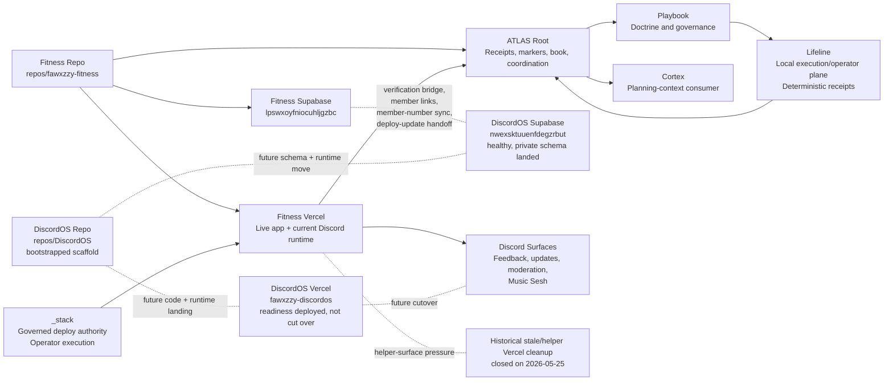

# Current System Map / Graph

## Purpose

This chapter is the compact cross-system map for the current stack.

It shows:

- which repos exist and who owns them
- which runtime and data surfaces are live today
- which future surfaces are planned but not active
- which contracts and approval gates block the next mutations

## Repo Map

### Current canonical repo surfaces

- `ATLAS`
  - stack coordination, receipts, markers, and book truth
- `repos/_stack`
  - governed deploy authority and shared operator execution
- `repos/fawxzzy-fitness`
  - Fitness app/runtime truth
  - current Discord-hosted runtime truth
- `repos/trove`
  - Trove repo-local runtime truth
- `repos/mazer`
  - Mazer repo-local runtime truth
- `repos/foundation`
  - Foundation repo-local runtime truth
- `repos/lifeline`
  - Lifeline repo-local operator and execution truth
  - manifest/runtime/release/startup/proof surface owner
- `repos/DiscordOS`
  - canonical DiscordOS repo surface now exists locally
  - infrastructure-ready DiscordOS owner surface
  - no migrated runtime code yet

## Runtime Map

### Current live runtime shape

- Fitness Vercel hosts:
  - Fitness app runtime
  - current Discord interaction/runtime
  - current feedback/update/moderation runtime
  - current Music Sesh runtime
- Lifeline provides:
  - local execution/operator runtime for manifest-defined apps
  - manifest validation and resolution
  - local runtime lifecycle, release, startup, and proof surfaces
- `_stack` remains the governed deploy authority
- ATLAS root does not host product runtime
- ATLAS root may host bounded continuation-classification helpers such as the guarded Codex continuation gate, but those remain control-plane receipt surfaces rather than product runtime; even its admitted live-command path stays operator-enabled, wrapper-bound, preserves the historical packaged WindowsApps blocker as a machine-readable host-runtime boundary, proves the active npm-installed Codex CLI surface is non-packaged and launchable, records the narrower `resume_requires_stdin_prompt` blocker when the bare resume command starts without prompt payload, separately freezes the help-surface truth that the broader resume family exposes `[PROMPT]` plus dash-stdin support, admits only the smaller prompt-bearing branch `codex exec resume --last <inline-prompt>` while still deferring dash-stdin prompt injection, owns the timeout boundary inside the gate itself so one hung live proof yields `resume_command_timeout` instead of an outer-shell-only failure, and now closes the root ladder for that blocker class after the timeout-boundary recheck packet lands

### Future runtime shape

- Fitness runtime stays Fitness-owned
- Discord runtime moves to DiscordOS-owned surfaces later
- Lifeline stays a narrow local execution/operator plane rather than widening into a hosted control plane
- `_stack` remains shared deploy and execution authority

## Lifeline System Role

Use [Lifeline](15-lifeline.md) for the full Book-level boundary.

Current Lifeline role:

- local execution/operator plane
- manifest plus optional Playbook export consumer
- deterministic receipt and proof emitter
- ATLAS systems lane component

Current non-goals:

- hosted control plane
- multi-node orchestrator
- generic data platform

Later work stays clearly separate:

- Vercel/service-health classification
- deploy provenance visibility
- stale-surface pressure signals
- broader ATLAS-facing health projection

## Supabase Project Map

### Current

- Fitness Supabase: `lpswxoyfniocuhljgzbc`
  - live Fitness auth/profile truth
  - verification issuance truth
  - current live Discord/Music Sesh operational tables

### Active preparation / future ownership

- DiscordOS Supabase: `nwexsktuuenfdegzrbut`
  - healthy
  - private schema `discordos` exists
  - RLS-enabled feedback runtime contract tables exist
  - Supabase Edge Function `discordos-readiness` is active with JWT verification
  - service-role readiness proof is live through the Supabase Edge Function path
  - no DiscordOS writer activation, traffic transfer, rollback, or live workflow parity proof exists yet
  - future home for Discord-owned runtime/workflow tables

## Vercel Project Map

### Canonical active surfaces

- `fawxzzy-fitness`
  - current live operational hotspot
  - canonical Fitness runtime truth
- `fawxzzy-trove`
  - active product surface
- `fawxzzy-mazer`
  - quieter active product surface
- `fawxzzy-foundation`
  - quieter systems/product surface
- `fawxzzy-discordos`
  - isolated DiscordOS readiness surface
  - canonical alias `https://fawxzzy-discordos.vercel.app`
  - service-role readiness now validates JWT role and DiscordOS project ref before reporting configured
  - service-role proof path is live through Supabase Edge Function runtime
  - Discord bot credential now validates through a read-only `/users/@me` readiness probe
  - activation guard is live and fail-closed for writer, traffic-transfer, rollback, and parity-proof gates
  - feedback shadow writer proof endpoint is live and no-persistence
  - guarded persisted-writer implementation endpoint is live, with proof-only Edge persistence available and an authenticated Fitness-to-DiscordOS non-proof persistence path deployed; final cutover still requires one real Discord-signed Fitness-origin event that creates the human non-proof row plus live traffic receipt ID capture and live workflow parity receipt capture
  - not live Discord workflow owner yet

### Known stale or duplicate-pressure surfaces

No helper Vercel project remains in the active live set after the 2026-05-25 helper-surface deletion pass.

Historical note:

- the stale Spotify-era Vercel projects were deleted on 2026-05-25 after dependency clearance
- the helper projects `fitness-deploy-green-panels` and `fitness-prod-rollout-20260525` were also deleted on 2026-05-25 after a clean dependency check

## DiscordOS / Fitness Shared-Seam Map

### Current shared seams

- verification bridge
- `discord_member_links`
- member-number sync
- deploy-to-update handoff
- current Discord/Music Sesh tables inside Fitness Supabase

### Future target posture

- Fitness keeps:
  - verification issuance
  - Fitness auth/profile truth
  - Fitness release proof
- DiscordOS later owns:
  - feedback runtime
  - update draft/publication runtime
  - moderation runtime
  - Music Sesh runtime

## `_stack` Command Ownership Map

`_stack` currently owns or should later own:

- governed deploy authority
- `stack validate` validation-summary command execution for ATLAS-owned validation posture
- admitted current-snapshot and delta-baseline validation-summary evidence discipline
- receipt-ready validation-summary report contract and contradiction routing
- bounded first validation-summary implementation slice plus proof-and-receipt closeout discipline
- `stack marker checkpoint` command execution for ATLAS-owned marker posture
- admitted marker-checkpoint restart-surface and cited-receipt discipline for ATLAS-owned marker posture
- receipt-ready marker-checkpoint report contract and contradiction routing for ATLAS-owned marker posture
- admitted marker-checkpoint implementation boundary and no-execution guard for ATLAS-owned marker posture
- bounded first marker-checkpoint implementation slice plus proof-and-receipt closeout discipline for ATLAS-owned marker posture
- admitted marker-checkpoint fixture/static proof boundary for ATLAS-owned marker posture
- admitted marker-checkpoint first implementation slice and proof matrix for ATLAS-owned marker posture
- admitted marker-checkpoint first implementation prompt-pack and handoff contract for ATLAS-owned marker posture
- admitted marker-checkpoint implementation-readiness closeout and worker-routing boundary for ATLAS-owned marker posture
- validation and receipt packaging helpers
- release-prep to deploy handoff
- stale-surface audit helpers
- future Vercel health classification helper

`_stack` does not own product or Discord runtime truth.

## Playbook Doctrine Flow

Current doctrine flow:

1. repeated receipt-backed rule appears in owner workflows
2. ATLAS records the pattern and convergence consequence
3. doctrine routing classifies it
4. operator-grade doctrine hardening ratifies only the receipt-backed, boundary-safe subset
5. restart and book mirrors may restate that doctrine without redefining it
6. Playbook later owns the reusable governance framing

Playbook does not become runtime owner at any step.

## Cortex Planning-Context Flow

Current planning-context flow:

1. ATLAS and receipt surfaces record durable state
2. ownership and seam docs create planning context
3. Cortex can later consume that planning context
4. Cortex does not currently mutate runtime or govern deploys

## Receipt / Proof Flow

Canonical flow:

1. owner repo or owner lane creates proof
2. `_stack` performs governed deploy where needed
3. owner repo records release or runtime proof
4. Discord publication consumes proof only after that
5. ATLAS records the cross-repo checkpoint
6. Playbook later extracts reusable doctrine

### Blocked consequence flow

When owner proof or release-readiness evidence freshness fails:

1. the owner repo stays not release-ready
2. `_stack` governed deploy authority stays blocked
3. owner release-ledger narration may record blocked state only
4. Discord publication stays blocked
5. ATLAS root may package blocked consequence only
6. blocked-work routing returns to the owner-side evidence-refresh packet

## Continuity / Retrieval Map

Retrieval-first continuity should be reconstructed in this order:

1. ATLAS canonical retrieval surfaces
   - marker table
   - receipt index
   - restart guide
   - system map
   - endgame surface
   - seeded initiative manifest health via `ops/atlas/continuity_manifest_health.py` or the awareness slice `continuity_initiative_manifest_health`; current seeded-set posture is `18 ok / 0 warning / 0 error`
   - eligible open-marker manifest coverage via `ops/atlas/continuity_open_marker_manifest_coverage.py` or the awareness slice `continuity_open_marker_manifest_coverage`; current posture is `8 / 8` eligible open markers manifest-backed
   - eligible open-marker restart index via `ops/atlas/continuity_open_marker_restart_index.py` or the awareness slice `continuity_open_marker_restart_index`; current posture is `8 / 8` eligible open markers restart-ready from one machine-readable index
   - maintained-manifest restart index via `ops/atlas/continuity_maintained_manifest_restart_index.py` or the awareness slice `continuity_maintained_manifest_restart_index`; current posture is `18 / 18` maintained initiative manifests restart-ready from one machine-readable index
2. owner-repo truth-owner surfaces
   - repo READMEs
   - repo-owned workflow docs
   - repo-owned verification or adoption surfaces
3. governed summary and promotion surfaces
   - promoted doctrine notes
   - lane receipts
4. non-authoritative transcript residue last

Rule:

- ATLAS owns the retrieval spine
- owner repos own repo-local truth
- chat recap is optional nuance, not restart authority

## Approval-Gated Lanes

Current approval-gated lanes:

- remote preview / unfurl verification

Historical note:

- the Fitness Supabase mutation gate chain was fully exercised and then closed by `docs/ops/FITNESS-SUPABASE-PROFILE-DATA-HYGIENE-FINAL-CLOSEOUT-2026-05-25.md`
- any future Fitness Supabase work must reopen as a new, narrower lane instead of treating profile/data hygiene as still generally open

## Future Split

### Fitness app lane

- product and UX
- QA/LLEL
- local/mobile proof
- Fitness profile/data hygiene when approved

### Discord work lane

- DiscordOS
- bot/runtime
- feedback/update/moderation workflows
- Music Sesh
- DiscordOS Supabase

### ATLAS systems lane

- ATLAS root
- `_stack`
- Foundation
- Lifeline
- Playbook
- Cortex planning surfaces
- markers, receipts, validation, and governance automation
- latest ATLAS-root immediate lane packet:
  - `_stack Readiness supervised execution-home concrete command-file choice implementation-readiness closeout and worker-routing pass 621`
  - superseding current-family update: the post-runtime-home-selection next-slice selector is durable through pass 566, the runtime-home choice contract is durable through pass 567, the runtime-home choice owner-facing home is durable through pass 568, the runtime-home choice support posture is durable through pass 569, the runtime-home choice first-implementation slice is durable through pass 570, the runtime-home choice worker handoff contract is durable through pass 571, the runtime-home choice readiness closeout is durable through pass 572, the bounded runtime-home-choice helper-and-proof worker cluster is now reconciled on canonical `main`, the post-runtime-home-choice next-slice selector is now durable through pass 573, the concrete-runtime-home-choice contract is now durable through pass 574, the concrete-runtime-home-choice owner-facing home is now durable through pass 575, the concrete-runtime-home-choice support posture is now durable through pass 576, the concrete-runtime-home-choice first-implementation slice is now durable through pass 577, the concrete-runtime-home-choice worker handoff contract is now durable through pass 578, the concrete-runtime-home-choice readiness closeout is now durable through pass 579, the bounded concrete-runtime-home-choice helper-and-proof worker cluster is now reconciled on canonical `main`, the post-concrete-runtime-home-choice next-slice selector is now durable through pass 580, the actual-concrete-runtime-home-choice contract is now durable through pass 581, the actual-concrete-runtime-home-choice owner-facing home is now durable through pass 582, the actual-concrete-runtime-home-choice support posture is now durable through pass 583, the actual-concrete-runtime-home-choice first-implementation slice is now durable through pass 584, the actual-concrete-runtime-home-choice worker handoff contract is now durable through pass 585, the actual-concrete-runtime-home-choice readiness closeout is now durable through pass 586, the bounded actual-concrete-runtime-home-choice helper-and-proof worker cluster is now reconciled on canonical `main`, the post-actual-concrete-runtime-home-choice next-slice selector is now also durable through pass 587, the actual-concrete-runtime-home-value-choice contract is now durable through pass 588, the owner-facing home for that same seam is now durable through pass 589, the support posture for that same seam is now durable through pass 590, the first-implementation slice for that same seam is now durable through pass 591, the worker handoff contract for that same seam is now durable through pass 592, the implementation-readiness closeout for that same seam is now durable through pass 593, the bounded actual-concrete-runtime-home-value-choice helper-and-proof worker cluster is now reconciled in the current root worktree, the post-actual-concrete-runtime-home-value-choice next-slice selector is now durable through pass 594, the actual-concrete-runtime-home-value contract is now durable through pass 595, the owner-facing home for that same value seam is now durable through pass 596, the support posture for that same value seam is now durable through pass 597, the first-implementation slice for that same value seam is now durable through pass 598, the worker handoff contract for that same value seam is now durable through pass 599, the implementation-readiness closeout for that same value seam is now durable through pass 600, the bounded actual-concrete-runtime-home-value helper-and-proof worker cluster is now reconciled in the current root worktree, the post-actual-concrete-runtime-home-value next-slice selector is now durable through pass 601, the actual-concrete-runtime-home-value-placement contract is now durable through pass 602, the actual-concrete-runtime-home-value-placement owner-facing home is now durable through pass 603, the actual-concrete-runtime-home-value-placement support posture is now durable through pass 604, the smallest fail-closed actual-concrete-runtime-home-value-placement first implementation slice is now durable through pass 605, the bounded prompt-pack and handoff contract for that same placement seam is now durable through pass 606, the bounded implementation-readiness closeout and worker-routing result for that same placement seam is now durable through pass 607, the bounded actual-concrete-runtime-home-value-placement helper-and-proof worker cluster is now reconciled in the current root worktree, the post-actual-concrete-runtime-home-value-placement next-slice selector is now durable through pass 608, the concrete `_stack` command-home choice contract is now durable through pass 609, the concrete `_stack` command-home choice owner-facing home is now durable through pass 610, the concrete `_stack` command-home choice support posture is now durable through pass 611, the smallest fail-closed concrete `_stack` command-home choice first implementation slice is now durable through pass 612, the bounded prompt-pack and handoff contract for that same concrete choice seam is now durable through pass 613, the bounded implementation-readiness closeout and worker-routing result for that same concrete choice seam is now durable through pass 614, the bounded concrete `_stack` command-home choice helper-and-proof worker cluster is now reconciled in the current root worktree, the post-concrete-stack-command-home-choice next-slice selector is now durable through pass 615, the concrete command-file choice contract is now durable through pass 616, the concrete command-file choice owner-facing home is now durable through pass 617, the concrete command-file choice support posture is now durable through pass 618, the concrete command-file choice first-implementation slice is now durable through pass 619, the concrete command-file choice prompt-pack and handoff contract is now durable through pass 620, the concrete command-file choice implementation-readiness closeout is now durable through pass 621, and the exact next package is now `_stack Readiness supervised execution-home concrete command-file choice first-implementation worker packet 1`
  - the old selector fallback boundary is now consumed: the AI Repetition selector family is exhausted, the generic `AI Long-Run Batch Orchestration queue-or-registry active follow-on` placeholder is cleared, the exact post-exhaustion non-`queue-or-registry` criteria contract remains `pass 462`, the owner-facing home is explicit through `pass 463`, support still honestly holds at `none yet` through `pass 464`, the first implementation slice is explicit through `pass 465`, the worker-routing boundary is explicit through `pass 467`, the bounded validator helper is already reconciled on canonical `main`, the candidate-comparison contract is explicit through `pass 468`, the owner-facing home for that comparison seam is explicit through `pass 469`, support for that comparison seam still honestly holds at `none yet` through `pass 470`, the smallest comparison implementation slice is explicit through `pass 471`, the exact prompt-pack and handoff boundary is explicit through `pass 472`, the exact readiness closeout is explicit through `pass 473`, the first comparison worker cluster is now reconciled on canonical `main`, the exact winner-conversion contract is now explicit through `pass 474`, the owner-facing home for that conversion seam is now explicit through `pass 475`, support for that conversion seam still honestly holds at `none yet` through `pass 476`, the smallest winner-conversion implementation slice is now explicit through `pass 477`, the exact winner-conversion prompt-pack and handoff boundary is now explicit through `pass 478`, the exact winner-conversion implementation-readiness closeout is now explicit through `pass 479`, the first winner-conversion worker cluster is now reconciled on canonical `main`, the winner-selection contract is now explicit through `pass 480`, the owner-facing home for that same seam is now explicit through `pass 481`, support for that same seam now honestly holds at `none yet` through `pass 482`, the smallest winner-selection implementation slice is now explicit through `pass 483`, the exact winner-selection prompt-pack and handoff boundary is now explicit through `pass 484`, the exact winner-selection implementation-readiness closeout is now explicit through `pass 485`, the first winner-selection worker cluster is now reconciled on canonical `main`, and the next honest family shifts to the post-winner-selection next-slice selector for that same pilot lane
  - that selector is now durable, the selected-pilot implementation-routing contract is now durable, the owner-facing home for that routing seam is now durable, the support posture for that routing seam now honestly holds at `none yet`, the smallest fail-closed first implementation slice for that routing seam is now durable, the worker handoff contract for that implementation seam is now durable, the readiness closeout for that same slice is now durable, and the bounded worker cluster is now reconciled on canonical `main`; the post-routing next-slice selector is now also durable, the selected-pilot owner-repo implementation contract is now also durable, the owner-facing home for that implementation seam is now also durable, the support posture for that implementation seam now honestly holds at `none yet`, the smallest fail-closed first implementation slice for that implementation seam is now also durable, the worker handoff contract for that implementation seam is now also durable, the readiness closeout for that implementation seam is now also durable, and the bounded owner-repo implementation worker cluster is now also reconciled on canonical `main`, the post-owner-repo-implementation next-slice selector is now also durable, the selected-pilot owner-repo mutation contract is now also durable, the owner-facing home for that mutation seam is now also durable, the support posture for that mutation seam now honestly holds at `none yet`, the smallest fail-closed first implementation slice for that mutation seam is now also durable, the worker handoff contract for that mutation seam is now also durable, the readiness closeout for that mutation seam is now also durable, and the bounded owner-repo mutation worker cluster is now also reconciled on canonical `main`, the post-owner-repo-mutation next-slice selector is now also durable, the selected-pilot actual owner-side mutation contract is now also durable, the owner-facing home for that actual owner-side mutation seam is now also durable, the support posture for that actual owner-side mutation seam now honestly holds at `none yet`, the smallest fail-closed first implementation slice for that actual owner-side mutation seam is now also durable, the worker handoff contract for that actual owner-side mutation seam is now also durable, the readiness closeout for that actual owner-side mutation seam is now also durable, and the bounded actual owner-side mutation worker cluster is now also reconciled on canonical `main`, the post-selected-pilot actual owner-side mutation next-slice selector is now also durable, the supervised execution-home contract is now also durable, the supervised execution-home owner-facing home is now also durable, the supervised execution-home support posture now honestly holds at `none yet`, the supervised execution-home command spine is now also durable, the supervised execution-home evidence-admission and contradiction discipline are now also durable, the supervised execution-home report-contract and no-mutation guard are now also durable, the supervised execution-home implementation-admission and no-mutation guard are now also durable, the supervised execution-home prompt-pack and handoff contract are now also durable, the supervised execution-home implementation-readiness closeout and worker-routing result are now also durable, the supervised execution-home worker cluster is now also reconciled on canonical `main`, the post-supervised-execution-home next-slice selector is now also durable, the command-home-selection contract is now also durable, the command-home owner-facing home is now also durable, the command-home support posture now honestly holds at `none yet`, the command-home first implementation slice is now also durable, the command-home worker handoff contract is now also durable, the command-home readiness closeout is now also durable, the command-home worker cluster is now also reconciled on canonical `main`, the post-command-home-selection next-slice selector is now also durable, the concrete command-home selection contract is now also durable, the concrete command-home owner-facing home is now also durable, the concrete command-home support posture now honestly holds at `none yet`, the concrete command-home first implementation slice is now also durable, the concrete command-home worker handoff contract is now also durable, the concrete command-home readiness closeout is now also durable, the concrete command-home worker cluster is now also reconciled on canonical `main`, the post-concrete-command-home next-slice selector is now also durable, the concrete `_stack` command-home selection contract is now also durable, the concrete `_stack` command-home owner-facing home is now also durable, the concrete `_stack` command-home support posture now honestly holds at `none yet`, the smallest fail-closed first implementation slice for that same seam is now also durable, the concrete `_stack` command-home prompt-pack and handoff contract is now also durable, the concrete `_stack` command-home readiness closeout is now also durable, the bounded concrete `_stack` command-home worker cluster is now also reconciled on canonical `main`, the post-concrete-stack-command-home next-slice selector is now also durable, the concrete command-file selection contract is now also durable, the concrete command-file owner-facing home is now also durable, the concrete command-file support posture now honestly holds at `none yet`, the smallest fail-closed concrete command-file first implementation slice is now also durable, the concrete command-file prompt-pack and handoff contract are now also durable, the concrete command-file implementation-readiness closeout is now also durable, the concrete command-file worker cluster is now also reconciled on canonical `main`, the post-concrete-command-file next-slice selector is now also durable, the concrete `_stack` command implementation-surface selection contract is now also durable, the concrete `_stack` command implementation-surface owner-facing home is now also durable, the concrete `_stack` command implementation-surface support posture now honestly holds at `none yet`, the smallest fail-closed concrete `_stack` command implementation-surface first implementation slice is now also durable, the concrete `_stack` command implementation-surface prompt-pack and handoff contract are now also durable, the concrete `_stack` command implementation-surface implementation-readiness closeout is now also durable, the bounded concrete `_stack` command implementation-surface worker cluster is now also reconciled on canonical `main`, the post-concrete-stack-command-implementation-surface next-slice selector is now also durable, the runtime-home selection contract is now also durable, the runtime-home selection owner-facing home is now also durable, the runtime-home selection support posture now honestly holds at `none yet`, the runtime-home selection first implementation slice is now also durable, the runtime-home selection prompt-pack and handoff contract are now also durable, the runtime-home selection implementation-readiness closeout is now also durable, the bounded runtime-home-selection worker cluster is now also reconciled on canonical `main`, the runtime-home choice contract is now also durable, the runtime-home choice owner-facing home is now also durable, the runtime-home choice support posture now honestly holds at `none yet`, the runtime-home choice first implementation slice is now also durable, the runtime-home choice prompt-pack and handoff contract are now also durable, the runtime-home choice implementation-readiness closeout is now also durable, the bounded runtime-home-choice worker cluster is now also reconciled on canonical `main`, the post-runtime-home-choice next-slice selector is now also durable, the concrete-runtime-home-choice contract is now also durable, the concrete-runtime-home-choice owner-facing home is now also durable, the concrete-runtime-home-choice support posture is now also durable, the concrete-runtime-home-choice worker handoff contract is now also durable, the concrete-runtime-home-choice readiness closeout is now also durable, the bounded concrete-runtime-home-choice worker cluster is now also reconciled on canonical `main`, the post-concrete-runtime-home-choice next-slice selector is now also durable, the actual-concrete-runtime-home-choice contract is now also durable, the actual-concrete-runtime-home-choice owner-facing home is now also durable, the actual-concrete-runtime-home-choice support posture is now also durable, the actual-concrete-runtime-home-choice first-implementation slice is now also durable, the actual-concrete-runtime-home-choice worker handoff contract is now also durable, the actual-concrete-runtime-home-choice readiness closeout is now also durable, the bounded actual-concrete-runtime-home-choice worker cluster is now also reconciled on canonical `main`, the post-actual-concrete-runtime-home-choice next-slice selector is now also durable, the actual-concrete-runtime-home-value-choice contract is now also durable, the owner-facing home for that same seam is now also durable, the support posture for that same seam now honestly holds at `none yet`, the first-implementation slice for that same seam is now also durable, the worker handoff contract for that same seam is now also durable, the implementation-readiness closeout for that same seam is now also durable, the bounded actual-concrete-runtime-home-value-choice worker cluster is now reconciled in the current root worktree, the post-actual-concrete-runtime-home-value-choice next-slice selector is now also durable, the actual-concrete-runtime-home-value contract is now also durable, the owner-facing home for that same value seam is now also durable, the support posture for that same value seam is now also durable, the first-implementation slice for that same value seam is now also durable, the worker handoff contract for that same value seam is now also durable, the implementation-readiness closeout for that same value seam is now also durable, the bounded actual-concrete-runtime-home-value worker cluster is now reconciled in the current root worktree, the actual-concrete-runtime-home-value-placement contract is now also durable, the actual-concrete-runtime-home-value-placement owner-facing home is now also durable, the actual-concrete-runtime-home-value-placement support posture is now also durable, the actual-concrete-runtime-home-value-placement first-implementation slice is now also durable, the actual-concrete-runtime-home-value-placement prompt-pack and handoff contract is now also durable, the actual-concrete-runtime-home-value-placement implementation-readiness closeout and worker-routing result is now also durable, and current root truth keeps one actual concrete runtime-home value placement, concrete `_stack` command-home choice, concrete command-file choice, one concrete `_stack` command implementation surface choice, owner-repo edits, actual owner-side mutation authority, and Playbook doctrine export blocked while naming `_stack Readiness supervised execution-home actual concrete runtime-home value placement first-implementation worker packet 1` as the exact next package
- current bounded seam progression:
  - retained-state descendant-layout contract freeze -> owner-surface admission -> supporting-lane hold at `none yet` -> first-implementation admission -> prompt-pack and handoff contract -> implementation-readiness closeout -> reconciled first implementation landing -> queue-home or registry-home reselection -> queue-home or registry-home contract freeze -> owner-surface admission -> supporting-lane hold at `none yet` -> first-implementation admission -> prompt-pack and handoff contract -> implementation-readiness closeout -> reconciled first implementation landing -> child-path or artifact-shape reselection -> child-path or artifact-shape contract freeze -> owner-surface admission -> supporting-lane hold at `none yet` -> first-implementation admission -> prompt-pack and handoff contract -> implementation-readiness closeout -> reconciled first implementation landing -> worker-artifact emission -> execution-bridge artifacts -> queue-drop emission -> launch-or-dispatch behavior -> claim-state movement -> done-state closure -> merge-request artifact behavior -> paused-status artifact behavior -> merger-assignment artifact behavior -> resume-context artifact behavior -> merge-completion behavior -> root-owned resume request or dispatch behavior -> broader queue-state history read model -> runtime-state discovery inventory -> supervisor runtime inventory -> execution-home runtime inventory -> canonical execution receipt selection -> canonical execution receipt writeback -> supervisor merge-request lineage selection -> provenance status surface hardening -> provenance-alert severity routing decision -> provenance-alert queue-proof and payload-boundary hardening -> provenance-alert render-status payload integration proof -> provenance-alert queue-signal budget decision -> provenance-alert queue-signal budget integration proof -> provenance-alert queue-signal budget restart truth receipt -> provenance-alert queue-signal budget next-slice selection -> provenance-alert top-level summary boundary contract freeze -> provenance-alert top-level summary boundary owner-surface admission -> provenance-alert top-level summary boundary supporting-lane hold at `none yet` -> provenance-alert top-level summary boundary first-implementation admission -> provenance-alert top-level summary boundary prompt-pack and handoff contract -> provenance-alert top-level summary boundary implementation-readiness closeout and worker-routing -> provenance-alert top-level summary boundary reconciled first implementation landing -> post-provenance-alert top-level summary boundary next-slice selection -> broader attention_queue semantics beyond provenance alerts contract freeze -> broader attention_queue semantics beyond provenance alerts owner-surface admission -> broader attention_queue semantics beyond provenance alerts supporting-lane hold at `none yet` -> broader attention_queue semantics beyond provenance alerts first-implementation admission -> broader attention_queue semantics beyond provenance alerts prompt-pack and handoff contract -> broader attention_queue semantics beyond provenance alerts implementation-readiness closeout and worker-routing -> broader attention_queue semantics beyond provenance alerts reconciled first implementation landing -> post-broader attention_queue semantics beyond provenance alerts next-slice selection -> broader attention_queue conversation_action_request contract freeze -> broader attention_queue conversation_action_request owner-surface admission -> broader attention_queue conversation_action_request supporting-lane hold at `none yet` -> broader attention_queue conversation_action_request first-implementation admission -> broader attention_queue conversation_action_request prompt-pack and handoff contract -> broader attention_queue conversation_action_request implementation-readiness closeout and worker-routing -> broader attention_queue conversation_action_request reconciled first implementation landing -> post-broader attention_queue conversation_action_request next-slice selection -> broader attention_queue quarantined_trust_surface contract freeze -> broader attention_queue quarantined_trust_surface owner-surface admission -> broader attention_queue quarantined_trust_surface supporting-lane hold at `none yet` -> broader attention_queue quarantined_trust_surface first-implementation admission -> broader attention_queue quarantined_trust_surface prompt-pack and handoff contract -> broader attention_queue quarantined_trust_surface implementation-readiness closeout and worker-routing -> broader attention_queue quarantined_trust_surface reconciled first implementation landing -> post-broader attention_queue quarantined_trust_surface next-slice selection -> broader attention_queue registry_error contract freeze -> broader attention_queue registry_error owner-surface admission -> broader attention_queue registry_error supporting-lane admission

## System Graph

## Machine-Readable Appendix

| Lane / surface | Owner | Source of truth | Current status | Blocker | Next package |
| --- | --- | --- | --- | --- | --- |
| Fitness app lane | Fitness | `repos/fawxzzy-fitness` plus Fitness release proof | release-readiness lane now resting green on clean preserved truth | stale evidence, governed QA auth secret-lane consumption, protected-route auth consumption, seam-proof aborts, proof-run drift, the linked Supabase migration-validator crash, clean-state preservation, and the governed notes gate are now all cleared; no exact owner-side release-readiness blocker remains | none immediate inside the owner-side release-readiness family; await fresh root-bounded lane selection |
| Discord work lane | Fitness-hosted now, DiscordOS later | Fitness repo/runtime now; `repos/DiscordOS` plus ATLAS separation receipts as future target | scaffold complete, bridge-independent DiscordOS work may resume, but the old root named-port planning ladder is already consumed and live runtime migration has not started | live Fitness Discord proof still depends on external/session bridge recovery; the May 26 planning and lookup-boundary chain already consumed the old generic next-package class; higher-level authorization is still required before any transport-aware, externally-executing, schema, or runtime follow-on | `none by default at ATLAS root; reopen only on explicit new DiscordOS named scope or higher-level authorization` |
| Post-convergence lane split readiness | ATLAS root | lane-split receipts plus ATLAS Book restart surfaces | closed at `100%`; the dedicated Fitness poll surface is live on production, consumed by the governed recurring worker path, and no longer acts as one mixed-runtime lane-structure ambiguity | none inside the current closed lane | none immediate; reopen only with a new owner-boundary ambiguity, retained-seam regression, or materially different runtime change |
| Fitness Supabase hygiene | Fitness | Fitness Supabase plus ATLAS closeout and governance receipts | closed at `100%`; remaining Discord/Music Sesh concerns transferred out of lane scope | none inside Fitness profile-core cleanup scope | defer any Discord/Music Sesh follow-on to Discord OS Infrastructure Separation |
| DiscordOS bootstrap | DiscordOS | `repos/DiscordOS`, `fawxzzy-discordos`, DiscordOS Supabase `nwexsktuuenfdegzrbut` | governance scaffold complete; private feedback runtime schema landed; Vercel project exists, is GitHub-linked, has a production readiness deployment, proves service-role readiness through Supabase Edge Function, validates the bot credential read-only, exposes a fail-closed activation guard, has a no-persistence feedback shadow writer proof endpoint, has a deployed guarded persisted-writer implementation path, proves Edge-backed proof-only persistence through Vercel, and now proves proof-only shadow transfer plus shadow parity | active Fitness traffic transfer and rollback execution proof remain open | active Fitness-to-DiscordOS traffic transfer and rollback execution packet |
| Helper Vercel decommission | ATLAS systems lane with owner confirmation | Vercel inventory and deletion receipts | stale Spotify-era and helper Fitness projects deleted | provenance clarity and future health classification only | preview/unfurl verification or Vercel health-design lane |
| Lifeline local execution/operator plane | Lifeline | `repos/lifeline` plus repo-local README, architecture, operator-surface, and startup-contract docs | shipped as a narrow local-first execution plane for manifest validation/resolution, runtime lifecycle, release, startup, proof, and deterministic receipts; consumes optional Playbook exports from disk and emits ATLAS-visible consequence without becoming a hosted control plane | broader Vercel/service-health classification, deploy provenance visibility, stale-surface pressure signals, and richer ATLAS-facing health projection remain later work; `_stack` still owns governed deploy authority | start with [Lifeline](15-lifeline.md), then the Lifeline repo truth surfaces; no immediate root-only Lifeline mutation packet is opened by this Book pass |

## Non-Goals

- no repo creation
- no code movement
- no data migration
- no Vercel mutation
- no Discord runtime change

