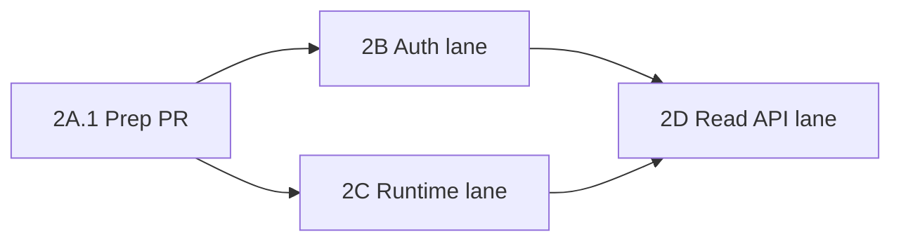

# Stream Wave 2 Runtime Split

This playbook turns the current `stream` runtime bring-up into a low-conflict ATLAS worker split.

Scope:

- stack-level coordination only
- owning repo: `repos/fawxzzy-stream`
- no feature modules
- no cross-repo implementation work

References:

- `stack.yaml`
- `docs/standards/WORKER-ORCHESTRATION.md`
- `docs/standards/WORKER-COLLISION-POLICY.md`
- `repos/fawxzzy-stream/AGENTS.md`
- `repos/fawxzzy-stream/docs/architecture/overview.md`
- `repos/fawxzzy-stream/docs/architecture/adapter-boundary.md`
- `repos/fawxzzy-stream/docs/architecture/v1-scope.md`

## Current read of the repo

The current `stream` repo already has the right runtime foundation:

- typed domain and persistence contracts exist
- append-only Twitch ingress exists
- reducer-driven current-session projection exists
- projection replay is already rebuildable from ingress
- `services/core-api` and `services/twitch-runtime` are already the intended runtime surfaces

Two of the four runtime guardrails are already present in code:

- projection snapshots already carry revision and high-water data through `revision` and `rebuiltFromSequence`
- worker leases already carry a lease token in addition to timestamps

Two guardrails are not yet explicit in the current persistence contract and should be handled before parallel runtime work:

- ingress records do not yet carry a `normalizationVersion`
- EventSub subscriptions do not yet carry a stable fingerprint for desired-vs-actual reconcile

## Execution rule

Freeze `packages/domain`, `packages/persistence/src/contracts.ts`, and the reducer/projection contract during runtime bring-up.

If either auth or runtime needs new contract fields, land one tiny prep PR first and then branch the worker lanes off that merged base.

## Merge plan

1. `2A.1` prep PR: persistence hardening for runtime reconcile
2. `2B` auth lane: broadcaster auth and token lifecycle
3. `2C` runtime lane: EventSub worker and projection updates
4. `2D` read API lane: status and inspection endpoints

`2B` and `2C` may run in parallel only after `2A.1` is merged or explicitly declared unnecessary.

## 2A.1 Prep PR

Issue title:

- `stream: freeze runtime contracts before Wave 2 auth/runtime split`

Why it exists:

- keep `2B` and `2C` from widening storage contracts in parallel
- make desired subscription reconciliation deterministic
- make future ingress re-normalization auditable

Required changes:

- add `normalizationVersion` to inbound Twitch ingress records and input validation
- add a stable EventSub subscription fingerprint derived from `provider + transport + type + version + normalized condition`
- define one canonical fingerprint builder in `packages/adapter-twitch`
- document the fingerprint and normalization rules in repo docs
- keep the change limited to persistence, the adapter fingerprint helper, and architecture/playbook docs

Likely touch set:

- `repos/fawxzzy-stream/packages/persistence/src/contracts.ts`
- `repos/fawxzzy-stream/packages/persistence/src/database.ts`
- `repos/fawxzzy-stream/packages/persistence/src/database.test.ts`
- `repos/fawxzzy-stream/docs/architecture/overview.md`
- `repos/fawxzzy-stream/docs/architecture/adapter-boundary.md`

Do not touch:

- `repos/fawxzzy-stream/packages/domain/**`
- `repos/fawxzzy-stream/packages/state-engine/src/reducer.ts`
- `repos/fawxzzy-stream/services/core-api/src/auth/**`
- `repos/fawxzzy-stream/services/twitch-runtime/**`

Acceptance:

- existing verify stays green
- `normalizationVersion` is treated as mapper-version metadata, not a DB schema label
- no reducer or domain contract widening
- runtime lanes can consume the new fields without further schema edits

Freeze point after merge:

- domain event contracts
- ingress record shape
- subscription record shape
- projection write contract

## 2B Auth lane

Issue title:

- `stream: add Twitch broadcaster auth and token lifecycle`

Objective:

- implement broadcaster auth, grant persistence, validation, refresh, and broadcaster identity with no EventSub runtime logic

Allowed scope:

- `repos/fawxzzy-stream/services/core-api/src/auth/**`
- `repos/fawxzzy-stream/services/core-api/src/bootstrap.ts`
- `repos/fawxzzy-stream/packages/adapter-twitch/src/auth/**`
- `repos/fawxzzy-stream/packages/persistence/**`
- `repos/fawxzzy-stream/docs/runbooks/twitch-auth.md`
- `repos/fawxzzy-stream/.env.example`

Forbidden scope:

- `repos/fawxzzy-stream/services/twitch-runtime/**`
- `repos/fawxzzy-stream/packages/adapter-twitch/src/eventsub/**`
- `repos/fawxzzy-stream/packages/domain/**`
- `repos/fawxzzy-stream/packages/state-engine/src/reducer.ts`

Required outputs:

- broadcaster connect and callback flow under `services/core-api`
- adapter-level auth service with:
  - `beginAuthFlow`
  - `completeAuthFlow`
  - `getValidBroadcasterAccessToken`
  - `invalidateBroadcasterGrant`
- persisted broadcaster grant, scopes, expiry metadata, and broadcaster identity
- startup validation and periodic validation hooks
- reactive refresh path for expired or invalid access tokens
- disconnected-state handling for revoked or failed auth

Acceptance:

- local broadcaster auth flow completes end to end
- broadcaster identity is persisted once and reused
- token validation succeeds on startup
- expired or invalid token flow refreshes and updates persistence
- revoked auth transitions cleanly to disconnected state
- `pnpm run verify` passes in `repos/fawxzzy-stream`

## 2C Runtime lane

Issue title:

- `stream: add minimal Twitch EventSub runtime worker`

Objective:

- implement the minimal EventSub runtime worker on the existing persistence and projection model with zero feature modules

Allowed scope:

- `repos/fawxzzy-stream/services/twitch-runtime/**`
- `repos/fawxzzy-stream/packages/adapter-twitch/src/eventsub/**`
- `repos/fawxzzy-stream/packages/persistence/**`
- `repos/fawxzzy-stream/packages/state-engine/**`
- `repos/fawxzzy-stream/docs/runbooks/twitch-runtime.md`

Forbidden scope:

- `repos/fawxzzy-stream/services/core-api/src/auth/**`
- `repos/fawxzzy-stream/packages/adapter-twitch/src/auth/**`
- `repos/fawxzzy-stream/packages/domain/**`
- feature-specific modules for voting, rewards, chat, moderation, or Mazer

Required outputs:

- websocket runtime manager for:
  - connect
  - welcome
  - keepalive
  - reconnect
  - notification
  - revocation
  - close
- persisted socket-session lifecycle state
- desired subscription planning for the minimal runtime set only
- deterministic reconcile against persisted actual subscriptions
- append-only ingress writes for inbound EventSub messages
- current-session projection updates through the existing reducer path
- boot and restart rebuild from stored ingress
- reconnect and reconcile hooks with no feature modules

Acceptance:

- runtime establishes one websocket session
- minimal desired subscriptions are created and persisted
- one provider message writes one ingress record
- duplicate notifications do not double-apply
- current-session projection updates from ingress
- restart rebuilds the same projection from stored ingress
- reconnect restores runtime health cleanly
- `pnpm run verify` passes in `repos/fawxzzy-stream`

## 2D Read API lane

Issue title:

- `stream: expose read-only runtime status endpoints`

Dependency:

- land after `2B` and `2C`

Objective:

- expose a minimal read surface for the future control room without mutating runtime contracts

Expected endpoints:

- current broadcaster connection
- current session projection
- recent ingress
- runtime health

Likely touch set:

- `repos/fawxzzy-stream/services/core-api/src/**`
- repo docs for API shape and operator usage

## Dependency graph

## Worker ownership guidance

- one worker for `2B`
- one worker for `2C`
- no shared editing of `packages/domain/**`
- avoid concurrent edits to the same persistence file unless the prep PR has already removed the schema gap
- if `2B` or `2C` detects new contract pressure, pause that lane and cut a separate prep PR instead of widening in place

## Recommended branch and review order

1. branch and land `2A.1`
2. cut `2B` and `2C` from the post-`2A.1` base
3. merge whichever of `2B` or `2C` finishes first after verify passes
4. rebase the other lane if shared persistence helpers changed but keep contracts frozen
5. cut `2D` only after both runtime lanes are merged

## Non-goals for Wave 2

- voting
- chat games
- monetization
- moderation automation
- Mazer integration
- Twitch extension feature logic
- OBS behavior beyond existing boundary documentation

## Functional target

The target is a real but minimal runtime core:

- auth can establish and maintain a valid broadcaster grant
- EventSub can connect, reconcile, ingest, and replay deterministically
- current session state is projection-backed and rebuildable
- the future control room can read runtime status without becoming the source of truth
